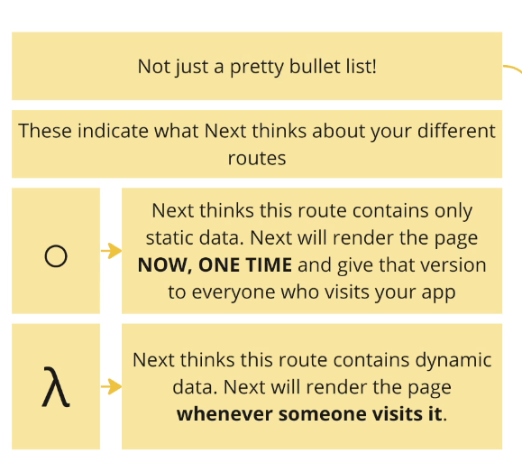

# Next.js by Stephen Grider
- 
- 
- One of the goals of Next is to expand the use of React to static sites.
- In Next.js we not only make dynamic and interactive sites, but we also make static content driven sites.
- 
- 
- "src/app" folder is a super special folder. The files and folders we place here determine what routes exist in our app.
- Files specifically called page.tsx define a route that the user can visit.
- The files must have an export default of a React component
```js
export default function Home() {
  return (
   <div>
     Home Page
   </div>
  );
}

```
- 
- The name of the folder that a page.tsx is in, controls the route.
- We can deeply nest routes as well
- 
- We can use file based routing to add pages to our application
- app folder contains all different route definitions
- routes are made by files called page.tsx 
- folder names determine the route in the browser.

## Link between pages
- Use Next's built in Link component to navigate between different routes.
- It looks like a normal anchor tag in HTML
```js
import Link from 'next/link';

export default function Home() {
  return (
   <div>
       <div>
           <Link className="mx-4" href="/performance">Performance</Link>
           <Link className="mx-4"  href="/reliability">Reliability</Link>
           <Link className="mx-4" href="/scale">Scale</Link>
       </div>
     Home Page
   </div>
  );
}

```
## Layout.tsx file in Next.js
- Like a global parent component for all of our pages.
- 
```js
export default function RootLayout({
                                       children,
                                   }: Readonly<{
    children: React.ReactNode;
}>) {
    return (
        <html lang="en">
            <body
                className={`${geistSans.variable} ${geistMono.variable} antialiased`}
            >
                <div>
                    <Link href="/">Home</Link>
                    <Link href="/performance">Performance</Link>
                    <Link href="/reliability">Reliability</Link>
                    <Link href="/scale">Scale</Link>
                </div>
                {children}
            </body>
        </html>
    );
}
```
## Building a folder structure
- 
- create a folder src/components
- create a Header component inside it
```js
import Link from "next/link";

export default function Header() {
    return (
        <div>
            <Link href="/">Home</Link>
            <Link href="/performance">Performance</Link>
            <Link href="/reliability">Reliability</Link>
            <Link href="/scale">Scale</Link>
        </div>
    )
}
```
## Absolute Path Import Shortcut
- We can use the @ symbol
- It is like a shortcut to go to the src directory
```js
import Header from "@/components/header";
```
- Can be read as src/components/header
- Very useful in super nested routes.

## Image Component in Next.js 
- 
- Good thing about image component is that when we are in production mode, if the user navigates to a page on a small screen, then this image component detects the screen size and automatically resizes the image.
- 
- Then, once the image is resized, it is automatically cached for that size and it doesnot need to be resized again.
- This is a very useful built-in feature in an image-heavy environment.
```js
import Image from 'next/image';
import homeImg from '../../public/home.jpg'

export default function Home() {
  return (
   <div>
     Home Page
       <div className="absolute -z-10 inset-0">
       <Image src={homeImg}
              alt="car factory"
              style={{objectFit: 'cover'}}
       />
       </div>
   </div>
  );
}

```
### Sizing of Image Component that is provided by Next.js
- 
- Let's assume a user is on a very slow internet connection.
- Loading the image may take time, so let's assume first the text is displayed.
- We don't want text to jump around the screen when the image is loaded.
- This is also called layout shifting and provides a bad user experience.
- Layout shifting is solved by Next.js image component
- When we load the image, we must have a placeholder component and that placeholder component should know how tall/wide should it be ?
- That placeholder must be perfectly sized so that when the image is loaded, the text on the right doesnot move.
- 
- 
- The fill prop in the Next.jsImage component is used to make the image take up the entire width and height of its parent element while maintaining its aspect ratio. 
- This is particularly useful when you want to ensure that the image fills its container completely, which is a common requirement for responsive designs.
```js
import Image from 'next/image';

const SampleImage = () => (
  <div style={{ position: 'relative', width: '100%', height: '500px' }}>
    <Image
      src="/path/to/image.jpg"
      alt="Sample Image"
      layout="fill"
      objectFit="cover" // You can also use other values like 'contain', 'cover', 'none', etc.
    />
  </div>
);

export default SampleImage;

```
- Parent Element (div): The parent element needs to have a position set to relative and specific width and height.
- layout="fill": This prop makes the Image component fill the width and height of the parent element.
- objectFit: This CSS property defines how the image should fit within its container. Common values are cover (fills the container while maintaining aspect ratio), contain (scales the image to fit within the container while maintaining aspect ratio), fill, none, and scale-down.
- The fill prop ensures that images adapt to different screen sizes and container dimensions.

## Creating a Reusable Component or Hero Component
- 
- We will pass some props to customize the component from our pages.
```js
import type {StaticImageData} from "next/image";
import Image from "next/image";


type HeroProps =  {
    imgData: StaticImageData;
    imgAlt: string;
    title: string;
}

export default function Hero(props: HeroProps){
    return (
        <div className="relative h-screen">
            <div className="absolute -z-10 inset-0">
                <Image src={props.imgData}
                       alt={props.imgAlt}
                       fill
                       style={{objectFit: 'cover'}}
                />
                <div className="absolute inset-0 bg-gradient-to-r from-slate-900">

                </div>
            </div>
            <div className="pt-48 flex justify-center items-center">
                <h1 className="text-white text-6xl">
                    {props.title}
                </h1>
            </div>
        </div>
    )
}
```
- We can use it as follows:
```js
import reliabilityImg from "../../../public/reliability.jpg";
import Hero from "@/components/Hero";

export default function ReliabilityPage() {
    return (
        <Hero imgData={reliabilityImg} imgAlt="welding" title="Super high reliability hosting"></Hero>
    )
}
```
- To our header we can add some styling like this:
```js
import Link from "next/link";

export default function Header() {
    return (
        <div className="w-full absolute text-white z-10 ">
            <nav className="container relative flex flex-wrap items-center justify-between mx-auto p-8">
            <Link href="/" className="font-bold text-3xl">Home</Link>
                <div className="space-x-4 text-xl">
            <Link href="/performance">Performance</Link>
            <Link href="/reliability">Reliability</Link>
            <Link href="/scale">Scale</Link>
                </div>
            </nav>
        </div>
    )
}
```

## Deploying the application
- If we want to deploy to vercel we will use npx vercel command in the terminal, and we will be asked to login to vercel.
- We will have to fill some metadata about our project

## Changing Data with Mutations
- To install prisma run the following commands 
```shell
npm install prisma 

npx prisma init --datasource-provider sqlite

//After creating a model inside schema.prisma, run this command
npx prisma migrate dev 
```
- Inside the schema.prisma file, write a model like this 
```js
generator client {
  provider = "prisma-client-js"
}

datasource db {
  provider = "sqlite"
  url      = env("DATABASE_URL")
}

model Snippet {
  id    Int    @id @default(autoincrement())
  title String
  code  String
}

```
- 
- Now we need to create a prisma client to access our database
```js
import {PrismaClient} from "@prisma/client";

//Will be used to perform CRUD operations
export const db = new PrismaClient();
// db.snippet.create({
//     data:{
//         title:'Title!',
//         code: 'const abc = () => {}'
//     }
// })
```
- Now we add a new create snippet form like this:
```js
export default  function SnippetCreatePage(){
    return(
        <form>
            <h3 className="font-bold m-3">Create a Snippet</h3>
            <div className="flex flex-col gap-4">
                <div className="flex gap-4">
                    <label className="w-12" htmlFor="title">
                        Title
                    </label>
                    <input
                        name="title"
                        className="border rounded p-2 w-full"
                        id="title"
                    />
                </div>
                <div className="flex gap-4">
                    <label className="w-12" htmlFor="code">
                        Code
                    </label>
                    <textarea
                        name="code"
                        className="border rounded p-2 w-full"
                        id="code"
                    />
                </div>
                <button type="submit" className="rounded p-2 bg-blue-200">
                    Create
                </button>
            </div>
        </form>
    )
}
```
- Remember default behavior of a form POST is to dump everything into a querystring, we use event.preventDefault() to circumvent that and we will use Server Actions

## Server Actions
- 
- Server actions are functions that will be called with the values a user entered into a form.
- To submit a form we will use a server action
```js
import {db} from '@/db';
import {redirect} from "next/navigation";

export default  function SnippetCreatePage(){

    async function createSnippet(formData:FormData){
        // This needs to be a server action
        //Special directive used by Next.js
        'use server';
        //Check the user's inputs and make sure they are valid
        //Typescript knows that whenever we want to get some data from a form, it is of type FormDataEntryValue so we cast it as string
        const title = formData.get('title') as string;
        const code = formData.get('code') as string;

        //Create a new record in the database
        const snippet = await db.snippet.create({
            data:{
                title: title,
                code: code
            }
        });
        console.log(snippet);
        // Redirect the user back to the root route
        redirect('/');
    }
    return(
        <form action={createSnippet}>
            <h3 className="font-bold m-3">Create a Snippet</h3>
            <div className="flex flex-col gap-4">
                <div className="flex gap-4">
                    <label className="w-12" htmlFor="title">
                        Title
                    </label>
                    <input
                        name="title"
                        className="border rounded p-2 w-full"
                        id="title"
                    />
                </div>
                <div className="flex gap-4">
                    <label className="w-12" htmlFor="code">
                        Code
                    </label>
                    <textarea
                        name="code"
                        className="border rounded p-2 w-full"
                        id="code"
                    />
                </div>
                <button type="submit" className="rounded p-2 bg-blue-200">
                    Create
                </button>
            </div>
        </form>
    )
}
```
- **_How traditional React app works**_ 
- 
- On Next.js things are different
- With Next.js some of our code is running on the browser and some of it runs on the server.
- - 
- Like in the above code, the createSnippet() function (Server action) is executed on the server.
- In the above code, whenever we submit the form, some javascript that runs on the browser collects the data and sends it off to a function that runs on the server.
- 
- Server actions run on the server. 
- Next.js create a miniature route handler behind the scenes to handle this interaction.

## Client Components and Server Components
- Next apps are built with 2 kinds of components: client components and server components
- 
- 
- Client components are those React components which we already use: they return some kind of JSX that is rendered into HTML, and then it is displayed on the screen
- Client components can use hooks, event handlers.
- Server components bend the rules of traditional components a little bit. Usually we want to use server components for better performance and UX.
- Prefer to use server components

### Server Components
- By default all components are server components.
- Server components can use async/await. Don't need useState or useEffect to do data fetching.
- 
- Server components have a few limitations: 
- We cannot use any kind of hook.
- We cannot assign any event handlers.
- 

### Client Components
- Created by adding 'use client' at the very top of the file
- Have all the usual rules of components
- Can have hooks, event handlers
- Cannot directly show a server component(there is one exception)
- 
- This will not work
- 

### When do we use each kind of component
- 
- Use client component if we need to use hooks or event handlers.
- 
- When a browser makes a request to next server, it sends some HTML immediately.
- Both server and client component are rendered into HTML and sent back to the browser.
- That HTML will also have a script tag inside of it which says look back into Next.js server and download some javascript.
- That javascript file will implement some event handlers or hooks.
- So that javascript file will force the browser to make a second request. 
- 
- When the second request reaches the Next.js server, it is going to look at all the client components and extract all the javascript from the client components, put it into a file and send it back to the browser.
- Even though we have client components, that client component gets rendered one time on the server
- Always favor using server components.

## Back to Fetching Data
- 
```js
import {db} from "@/db"

export default async function Home() {
  const snippets = await db.snippet.findMany();

  const renderedSnippets = snippets.map((snippet) => {
    return (
        <div key={snippet.id}>
          {snippet.title}
        </div>
    )
  });

  return (
    <div>
      <h3 className="font-bold m-3">List of snippets</h3>
      <div>
        {renderedSnippets}
      </div>
    </div>
  );
}

```

## Adding Dynamic Paths
- 
- Dynamic Path is like a wildcard.
- 
- These square brackets are like a wildcard. They will match anything after the word "snippets" in their path.
- 
- Next.js is going to capture this value and pass it as a props to our component
```js
    export default function SnippetShowPage(props:any){
    console.log(props);
    return (
    <div>
    Snippet Show Page
    </div>
    )

}
```
- This will print the following in the console when we navigate to localhost:3000/snippets/7:
- 
- Please note it is always treated as a string. It has a property name of "id" because that's the name of the folder.

## Async Dynamic Params in Next.js
- In Next.js 15 we must await params or searchParams before accessing.
```js
const { id } = await props.params;
 
  const snippet = await db.snippet.findFirst({
    where: { id: parseInt(id) },
  });
```
- Also, we need to update the Interface and wrap the params in a Promise
```js
interface SnippetShowPageProps {
  params: Promise<{
    id: string;
  }>;
}
```
- To use dynamic params in our application we can do this:
```js
import {db} from "@/db"
import {notFound} from "next/navigation";

type SnippetShowPageProps = {
    params:{
        id:string
    }
}

export default async function SnippetShowPage(props:SnippetShowPageProps) {
    const snippet = await db.snippet.findFirst({
        where: {
            id: parseInt(props.params.id)
        }
    });
    if(!snippet){
        return notFound();
    }
    return (
        <div>
            {snippet.title}
        </div>
    )

}
```

## Custom Not Found Pages
- We have some special file names in the "app" folder
- 
- We will create a not-found.tsx file inside the [id] folder like this
```js
export default async function NotFound(){
    return (<div>
        <h1 className="text-xl bold">
            Sorry, we could not find that particular snippet!
        </h1>
    </div>)
}
```
- Now from our component inside [id]/page.tsx when we call the function return notFound() we will be navigated to the not-found.tsx page.

## Automatic Loading Spinners
- We have a special file loading.tsx
- This is displayed when a server component is fetching some data.
```js
export default function SnippetShowLoadingPage(){
    return <div>Loading...</div>
}
```
## Creating a snippet edit page
- 
- Inside the [id] folder create a new folder called edit and add a page.tsx inside of it.
- We can pass the params to the edit page when we navigate to : "http://localhost:3000/snippets/2/edit"
```js

type SnippetEditPageProps = {
    params:{
        id:string
    }
}
export default function SnippetEditPage(props:SnippetEditPageProps) {
      const id = parseInt(props.params.id);
      return (
          <div>
              Edit snippet with id: {id}
          </div>
      )
}
```
## Showing a client component inside a server component
- 
- Since inside the edit page we need to do data fetching using async await keywords, we cannot make it a client component.
- 
- We will create a client component called SnippetEditForm, and we will pass the snippet down from our server component to the client component as a prop.
- This client component will set up state and event handlers to work with Monaco Editor
- Client components are rendered on the server the first time and a second request will come in from the browser and load up all the javascript required to attach all the hooks and event handlers.
- We can have a server component like this:
```js
import {db} from "@/db"
import {notFound} from "next/navigation";
import SnippetEditForm from "@/components/SnippetEditForm";

type SnippetEditPageProps = {
    params:{
        id:string
    }
}
export default async function SnippetEditPage(props:SnippetEditPageProps) {
      const id = parseInt(props.params.id);
      const snippet = await db.snippet.findFirst({
          where: {
              id:id
          }
      });

      if(!snippet){
          return notFound();
      }

      return (
          <div>
             <SnippetEditForm snippet={snippet} />
          </div>
      )
}
```
- We will have a client component SnippetEditForm like this:
```js
'use client'
import type {Snippet} from "@prisma/client";

type SnippetEditFormProps = {
    snippet: Snippet;
}
export default function SnippetEditForm({snippet}: SnippetEditFormProps) {
    return (
        <div>
            Client component has snippet with title: {snippet.title}
        </div>
    )
}
```

## Adding state inside the Client Component 
- Inside our snippet edit form client component, we can use the monaco editor and whenever the value of snippet code changes, we need to hold it in a useState() hook like this:
- Note that the snippet is being passed to us as a prop from the server component.
```js
'use client'
import type {Snippet} from "@prisma/client";
import {Editor} from "@monaco-editor/react";
import {useState} from "react";

type SnippetEditFormProps = {
    snippet: Snippet;
}
export default function SnippetEditForm({snippet}: SnippetEditFormProps) {

    const [code,setCode] = useState(snippet.code);
    const handleEditorChange = (value:string = "") =>{
        console.log(value)
        setCode(value);
    }
    
    return (
        <div>
           <Editor
               theme="vs-dark"
               language="javascript"
               defaultValue={snippet.code}
               height="40vh"
               options={{
                   minimap:{enabled:false},
               }}
               onChange={handleEditorChange}
               />
        </div>
    )
}
```
- Now once we have the code in a state variable, we need to update the snippet code in the database. Hence, we may need to call a server action

## Using Server Actions in Next.js Client Components
- Saving and changing data is done using Server Actions
- Server Actions cannot be defined inside Client Components
- 
- To use Server Actions in a Client Component, we can either export them from a separate file with "use server" at the top, or pass them down through props from a Server Component.
- 
- 
- Server components cant pass event handlers down to client components: this is one exception
- 
- 
- Option #2 is preferred where we define our server actions in a separate file and import it into Client Component
- It promotes code reuse.

## Server Actions in a separate file
- In src folder, make a new folder called actions and add a file index.ts 
- Here we will define our server actions
- To call a server action from a client component, first import it.
- We can import it as:
```js
import * as actions from "@/actions";
```
- This way if we write action.editSnippet() we can access all actions inside that index.ts file

## Options for calling Server Actions from Client Component
- Option # 1
- 
- We use the bind function to bind our state to the server action.
- We can then use a form and submit it.
- 
- Option # 2
- 
- Here we don't use a form, there is no formdata, so only the arguments passed directly to server action are received.
- 
- Here we use startTransition hook
- startTransition() makes sure we don't navigate away before our data actually has been updated.
- The useTransition hook is a React hook that enables you to create non-blocking updates in your application, which can greatly improve the user experience by keeping your interface responsive during transitions.
- While this hook isn't specific to Next.js, it's a part of React's core that you can use in any React-based application, including those built with Next.js.
- The useTransition hook allows you to mark state updates as transitions, which are lower-priority updates. This can be useful when you want to avoid blocking user interactions with high-priority updates, such as typing in an input field or clicking a button.
```js
//Api logic
// pages/api/action.js
export default function handler(req, res) {
    if (req.method === 'POST') {
        const { data } = req.body;
        // Perform some server-side action with data
        res.status(200).json({ message: `Processed data: ${data}` });
    } else {
        res.status(405).json({ message: 'Method Not Allowed' });
    }
}


//Server Action
// lib/actions.ts
export async function serverAction(data: string) {
    const response = await fetch('/api/action', {
        method: 'POST',
        headers: {
            'Content-Type': 'application/json',
        },
        body: JSON.stringify({ data }),
    });
    return response.json();
}


//Client Component
import { useState } from 'react';
import { serverAction } from '../lib/actions';

const MyComponent = () => {
  const [data, setData] = useState('');
  const [message, setMessage] = useState('');

  const handleSubmit = async (e) => {
    e.preventDefault();
    const result = await serverAction(data);
    setMessage(result.message);
  };

  return (
    <div>
      <form onSubmit={handleSubmit}>
        <input
          type="text"
          value={data}
          onChange={(e) => setData(e.target.value)}
          placeholder="Enter some data"
        />
        <button type="submit">Submit</button>
      </form>
      {message && <p>{message}</p>}
    </div>
  );
};

export default MyComponent;

```
- 
- Option #1 is generally preferred even by Next.js documentation where we use a form
- So to demonstrate how Option #1 using a form and a bind() function, we first make changes in our actions/index.ts file 
```js
export async function editSnippet(id:number, code:string){
    console.log(id,code);
}
```
- Now we make changes inside our client component:
```js
'use client'
import type {Snippet} from "@prisma/client";
import {Editor} from "@monaco-editor/react";
import {useState} from "react";
import * as actions from "@/actions";

type SnippetEditFormProps = {
    snippet: Snippet;
}
export default function SnippetEditForm({snippet}: SnippetEditFormProps) {

    const [code,setCode] = useState(snippet.code);
    const handleEditorChange = (value:string = "") =>{
        console.log(value)
        setCode(value);
    }

    const editSnippetAction = actions.editSnippet.bind(null,snippet.id,code);

    return (
        <div>
           <Editor
               theme="vs-dark"
               language="javascript"
               defaultValue={snippet.code}
               height="40vh"
               options={{
                   minimap:{enabled:false},
               }}
               onChange={handleEditorChange}
               />
            <form action={editSnippetAction}>
                <button type="submit" className="p-2 border rounded">Save</button>
            </form>
        </div>
    )
}
```

## Deleting a snippet
- First we will create an action inside our actions.ts file like this 
```js
export async function deleteSnippet(id:number){
    await db.snippet.delete({
        where:{id:id}
    });

    redirect('/');
}
```
- Next we will call the snippet this action from our [id]/page.tsx file like this
```js
import {db} from "@/db"
import {notFound} from "next/navigation";
import Link from "next/link";
import * as actions from "@/actions";

type SnippetShowPageProps = {
    params:{
        id:string
    }
}

export default async function SnippetShowPage(props:SnippetShowPageProps) {

    //Add some artificial delay
    await new Promise((r)=>setTimeout(r,2000))


    const snippet = await db.snippet.findFirst({
        where: {
            id: parseInt(props.params.id)
        }
    });
    if(!snippet){
        return notFound()
    }

    const handleDeleteAction = actions.deleteSnippet.bind(null,snippet.id)
    return (
        <div>
            <div className="flex m-4 justify-between items-center">
                <h1 className="text-xl font-bold">{snippet.title}</h1>
                <div className="flex gap-4">
                    <Link href={`/snippets/${snippet.id}/edit`} className="p-2 border rounded">Edit</Link>
                    <form action={handleDeleteAction}>
                        <button  className="p-2 border rounded">Delete</button>
                    </form>
                </div>
            </div>
            <pre className="p-3 border rounded bg-grey-200 border-gray-200">
                <code>{snippet.code}</code>
            </pre>
        </div>
    )

}
```
- The good thing about using the bind() function approach, is that even if the user has disabled javascript inside their browser, it will still work.

## Server Forms with the UseFormState() hook
- \
- We can useFormState hook to communicate information from the server action back to the page.
- Remember a good thing about forms is that they can work without JS in the browser.
- We should get our page rendered again with some error message being displayed
- useFormState is a hook in React-DOM. 
- It can only be used with a client component.
- Remember client components are rendered once on the server, but they allow us to run Javascript in the browser.
- 
- We will send useFormState along with FormData to the server action.
- Server communicate will add some information to the FormState and send it back to the client component
- Client component will re-render once it receives the FormState object, and it can display error messages if there are any in the FormState object.

## Changes in Next.js v15
- In the Next.js v15, useFormState() has been changed to useActionState()

## Implementing useFormState hook
- Note that we are going to turn our new snippet component inside new/page.tsx into a client component
- We will pass an initial object of formState to the server action and get back an object which has error message inside of it.
- Use the useFormState hook in a client component to handle form submissions and call the server action.
- We will move the createSnippet() function inside a server action like this
```js
export async function createSnippet(formState:{message:string}, formData:FormData) {
    return {
        message: 'Title must be longer'
    }
}
```
- Now we will call this from our client component as follows:
- Note that when we use the useFormState hook we pass the name of the server action as well as an initial object for formState.
- This will contain the error message which will be returned inside the formState object along with a detailed server action which we can pass inside our form action
```js
'use client'
import {useFormState} from 'react-dom'
import * as actions from '@/actions'

export default  function SnippetCreatePage(){
    const [formState,action]= useFormState(actions.createSnippet,{message:''});


    return(
        <form action={action}>
            <h3 className="font-bold m-3">Create a Snippet</h3>
            <div className="flex flex-col gap-4">
                <div className="flex gap-4">
                    <label className="w-12" htmlFor="title">
                        Title
                    </label>
                    <input
                        name="title"
                        className="border rounded p-2 w-full"
                        id="title"
                    />
                </div>
                <div className="flex gap-4">
                    <label className="w-12" htmlFor="code">
                        Code
                    </label>
                    <textarea
                        name="code"
                        className="border rounded p-2 w-full"
                        id="code"
                    />
                </div>
                <div>
                    {formState.message}
                </div>
                <button type="submit" className="rounded p-2 bg-blue-200">
                    Create
                </button>
            </div>
        </form>
    )
}
```

## Breaking changes in Forms in React 19
- Forms are now reset after submission by default. 
- We will need to make a few major adjustments to the code that will mitigate the resetting of the form
- In src/app/snippets/new/page.tsx:

1. import the startTransition hook
```js
import { useActionState, startTransition } from "react";
```
2. Create a handleSubmit function

```js
function handleSubmit(event: React.FormEvent<HTMLFormElement>) {
event.preventDefault();
const formData = new FormData(event.currentTarget);
startTransition(() => {
action(formData);
});
}
```
3. Pass the new handleSubmit function to the onSubmit prop to opt out of the form reset
```js
<form onSubmit={handleSubmit}>
```

## Adding the Form Validation
```js
export async function createSnippet(formState:{message:string}, formData:FormData){

    // This needs to be a server action
    //Special directive used by Next.js
    //'use server';
    //Check the user's inputs and make sure they are valid
    //Typescript knows that whenever we want to get some data from a form, it is of type FormDataEntryValue so we cast it as string
    const title = formData.get('title');
    const code = formData.get('code');

    const errorText : {message: string} = {message:""}

    if(typeof title !== 'string' || title.length < 3){
        errorText.message = 'Title must be longer and should be a string';
    }

    if(typeof code !== 'string' || code.length < 10){
        errorText.message+= "/n" + 'Code must be longer and should be a string';
    }

    if(errorText.message.length >0){
        return errorText;
    }

    //Create a new record in the database
    const snippet = await db.snippet.create({
        data:{
            title: title as string,
            code: code as string
        }
    });

    // Redirect the user back to the root route
    redirect('/');
}
```
- For error handling we have a special filename: error.tsx. This is useful for unhandled exceptions.
- 
- The error file must be a client component.
- However, there is a big downside to this error file. The user doesn't have the ability to resubmit the form after fixing the error or try again.
- What we can do is that instead of throwing error inside our server action, we catch the error and populate it inside the formState object and send it back to the client or the browser.
- We can do something like this to catch the error, populate the formState object and send it back to the client
```js
export async function createSnippet(formState:{message:string}, formData:FormData){
    const errorText: { message: string } = {message: ""}
    // This needs to be a server action
    //Special directive used by Next.js
    //'use server';
    //Check the user's inputs and make sure they are valid
    //Typescript knows that whenever we want to get some data from a form, it is of type FormDataEntryValue so we cast it as string
    try {
        const title = formData.get('title');
        const code = formData.get('code');


        if (typeof title !== 'string' || title.length < 3) {
            errorText.message = 'Title must be longer and should be a string';
        }

        if (typeof code !== 'string' || code.length < 10) {
            errorText.message += "/n" + 'Code must be longer and should be a string';
        }


        // //Create a new record in the database
        // const snippet = await db.snippet.create({
        //     data:{
        //         title: title as string,
        //         code: code as string
        //     }
        // });

        throw new Error("Failed to create a new snippet");
    }
    catch (error: unknown) {
        if(error instanceof Error){
            errorText.message += error.message;
        } else {
            errorText.message += "Something went wrong";
        }
    }

    if (errorText.message.length > 0) {
        return errorText;
    }

    // Redirect the user back to the root route
    redirect('/');
}
```
- 
## Interesting thing about redirect function
- 
- If we use a redirect() function inside a try-catch block, then we are going to see something like this
- 
- This is because when the compiler sees redirect, it actually throws an error but then Next.js understands that this is not an error and user is just being redirected, and it works fine, but if put inside a try-catch block, error is thrown.
- catch statement captures the error
- So we don't want to put our redirect() function inside a try-catch statement, always put it outside.

## Next.js Caching System
- We can build our application by running npm run build
- Then we can run our project in production mode using npm run start
- However, when we run the app in production mode and create a snippet, the snippet is displayed in the list of snippets on the main page.
- However, when we refresh, the newly created snippet disappears. This is because of Next.js Full Route Caching.
- Note that our home route (/) is pre-rendered as static content.
- 
- 
- Next.js implements caching in several locations
- It can lead to unexpected behavior.
- When we build our application for production, we have Full Route caching system
- Here at build time, Next.js decides whether your route is static or dynamic. If it is static, page is rendered and result is stored.
- In Production, users are given this pre-rendered result
- 
- Next.js assumes our homepage route is static.
- Since it is static, next is going to implement really aggressive caching on this route.
- Our homepage has some code which gets a list of snippets, Next.js will execute this code, get the snippets, render the HTML and serve it to everyone who navigates to this homepage route.
- This default behavior is not appropriate as each user should see the updated list of snippets.
- We will have to configure this.

## What makes a static or Dynamic Route in Next.js
- 
- 
- Bullet point indicates static page.
- Lambda indicates dynamic page.
- All pages by default in Next.js are static pages.
- In order to become dynamic pages, we have to do few different things inside the route.
- 
- Any route with a wildcard like [id] is a dynamic route.
- We can also force a route to become dynamic by writing this at top of the page:
```js
export const dynamic = "force-dynamic"
```
- A static route is not the worst thing in the world. We need caching!
- But our data even if cached, will change. We need to invalidate and force the cache to update.

## When to use cache control
- 
- **Time based Caching**
- 
```js
//Every 3 seconds, the next request that comes in will trigger a re-render of our page. For the next 3 seconds, the cached version will be served up
//Revalidate is a reserved keyword
export const revalidate = 3;
```
- **On Demand Caching**
- 
- At certain points of time, if we are certain that data used by some path has changed, we can revalidate the cache like this
- This tell Next.js that we want to dump the cached version of the page, and that everytime someone makes a request, we should re-render the page from scratch
```js
import {revalidatePath} from "next/cache"
//When we thik data that the '/snippets'
//route uses has changed...
revalidatePath('/snippets')
```
- **Disable Caching**
- 

- **There are specific use cases for each type of caching**
- 
- 
- 

## Using revalidatePath() in server actions page
```js
import {revalidatePath} from "next/cache";


export async function deleteSnippet(id:number){
    await db.snippet.delete({
        where:{id:id}
    });

    //Revalidate the cached version of homepage
    revalidatePath('/');
    redirect('/');
}

export async function createSnippet(formState:{message:string}, formData:FormData){
    const errorText: { message: string } = {message: ""}
    // This needs to be a server action
    //Special directive used by Next.js
    //'use server';
    //Check the user's inputs and make sure they are valid
    //Typescript knows that whenever we want to get some data from a form, it is of type FormDataEntryValue so we cast it as string
    try {
        const title = formData.get('title');
        const code = formData.get('code');


        if (typeof title !== 'string' || title.length < 3) {
            errorText.message = 'Title must be longer and should be a string';
        }

        if (typeof code !== 'string' || code.length < 10) {
            errorText.message += "/n" + 'Code must be longer and should be a string';
        }


        //Create a new record in the database
        await db.snippet.create({
            data:{
                title: title as string,
                code: code as string
            }
        });
    }
    catch (error: unknown) {
        if(error instanceof Error){
            errorText.message += error.message;
        } else {
            errorText.message += "Something went wrong";
        }
    }

    if (errorText.message.length > 0) {
        return errorText;
    }

    //Revalidate the cached version of homepage
    revalidatePath('/');

    // Redirect the user back to the root route
    redirect('/');
}
```

## Enabling Caching with GenerateStaticParams
- 
- 2 of our paths were marked as dynamic because they have a wildcard path in their URL
- This is not the best thing in the world. We lose on the benefit of caching.
- We can use a function called GenerateStaticParams() here to implement some sort of caching even for our dynamic paths.
- 
- 
- GenerateStaticParams() is a function that will run and go to the database and fetch all the ids for the snippets and generate an array of these IDs.
- Remember, these IDs are used to generate the dynamic page: [id]
- So this function is going to generate different URLs based on the IDs fetched from the database and cache the result of those URLs
- So we can cache some of these pages even though they are supposed to be dynamic.

## Caching Dynamic Routes
- Go to [id]/page.tsx and write this function
```js
export async function generateStaticParams(){
    const snippets = await db.snippet.findMany();
    return snippets.map((snippet)=>{
        return {
            id: snippet.id.toString(),
        };
    })
}
```
- Now run npm run build
- 
- As we can see Next.js has made cached version of our snippet pages which is pre-rendered as static HTML
- However, if we edit the page, we now face the same problem, we don't get the latest output, so we need to revalidate it.
- We can go back to our edit Snippet action and change it as follows:
```js
export async function editSnippet(id:number, code:string){
    await db.snippet.update({
        where:{id:id},
        data: {code:code}
    });

    revalidatePath(`/snippets/${id}`);
    redirect(`/snippets/${id}`);
}
```


