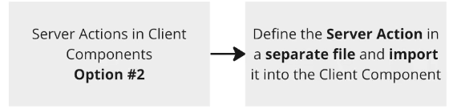
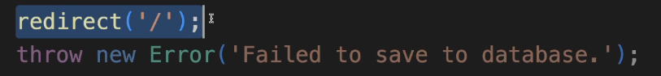
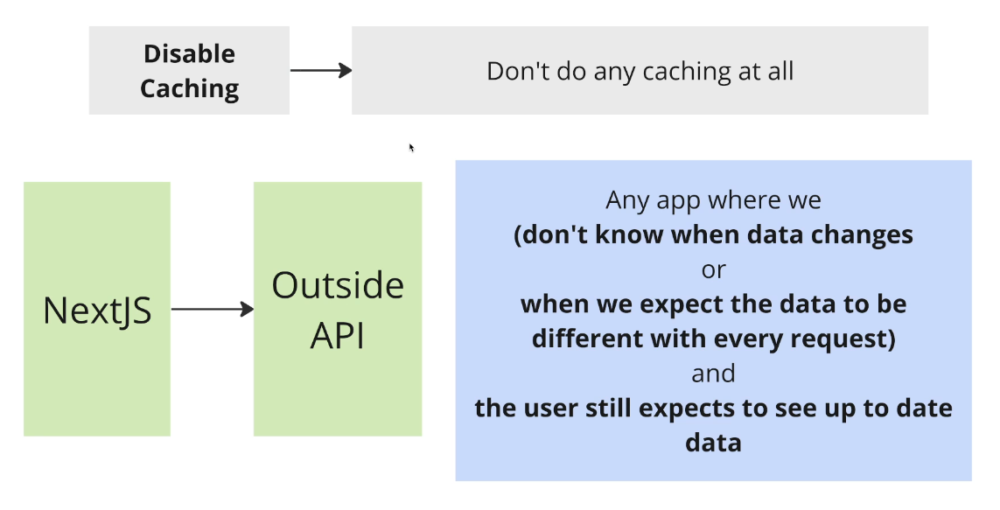
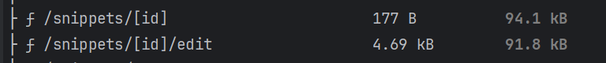
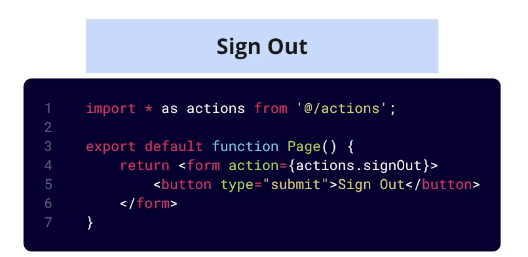
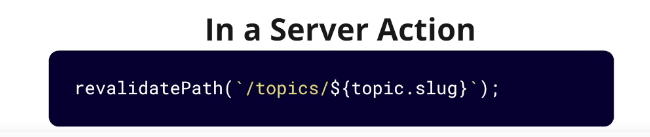
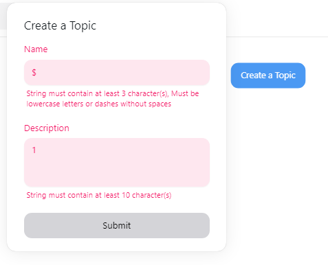
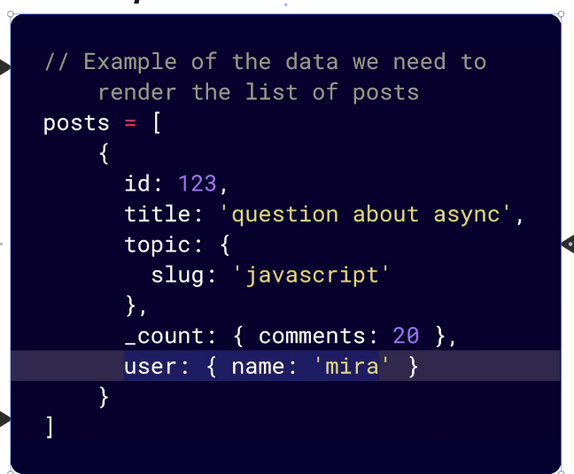

# Next.js by Stephen Grider
- 
- 
- One of the goals of Next is to expand the use of React to static sites.
- In Next.js we not only make dynamic and interactive sites, but we also make static content driven sites.
- 
- 
- "src/app" folder is a super special folder. The files and folders we place here determine what routes exist in our app.
- Files specifically called page.tsx define a route that the user can visit.
- The files must have an export default of a React component
```js
export default function Home() {
  return (
   <div>
     Home Page
   </div>
  );
}

```
- 
- The name of the folder that a page.tsx is in, controls the route.
- We can deeply nest routes as well
- 
- We can use file based routing to add pages to our application
- app folder contains all different route definitions
- routes are made by files called page.tsx 
- folder names determine the route in the browser.

## Link between pages
- Use Next's built in Link component to navigate between different routes.
- It looks like a normal anchor tag in HTML
```js
import Link from 'next/link';

export default function Home() {
  return (
   <div>
       <div>
           <Link className="mx-4" href="/performance">Performance</Link>
           <Link className="mx-4"  href="/reliability">Reliability</Link>
           <Link className="mx-4" href="/scale">Scale</Link>
       </div>
     Home Page
   </div>
  );
}

```
## Layout.tsx file in Next.js
- Like a global parent component for all of our pages.
- 
```js
export default function RootLayout({
                                       children,
                                   }: Readonly<{
    children: React.ReactNode;
}>) {
    return (
        <html lang="en">
            <body
                className={`${geistSans.variable} ${geistMono.variable} antialiased`}
            >
                <div>
                    <Link href="/">Home</Link>
                    <Link href="/performance">Performance</Link>
                    <Link href="/reliability">Reliability</Link>
                    <Link href="/scale">Scale</Link>
                </div>
                {children}
            </body>
        </html>
    );
}
```
## Building a folder structure
- 
- create a folder src/components
- create a Header component inside it
```js
import Link from "next/link";

export default function Header() {
    return (
        <div>
            <Link href="/">Home</Link>
            <Link href="/performance">Performance</Link>
            <Link href="/reliability">Reliability</Link>
            <Link href="/scale">Scale</Link>
        </div>
    )
}
```
## Absolute Path Import Shortcut
- We can use the @ symbol
- It is like a shortcut to go to the src directory
```js
import Header from "@/components/header";
```
- Can be read as src/components/header
- Very useful in super nested routes.

## Image Component in Next.js 
- 
- Good thing about image component is that when we are in production mode, if the user navigates to a page on a small screen, then this image component detects the screen size and automatically resizes the image.
- 
- Then, once the image is resized, it is automatically cached for that size and it doesnot need to be resized again.
- This is a very useful built-in feature in an image-heavy environment.
```js
import Image from 'next/image';
import homeImg from '../../public/home.jpg'

export default function Home() {
  return (
   <div>
     Home Page
       <div className="absolute -z-10 inset-0">
       <Image src={homeImg}
              alt="car factory"
              style={{objectFit: 'cover'}}
       />
       </div>
   </div>
  );
}

```
### Sizing of Image Component that is provided by Next.js
- 
- Let's assume a user is on a very slow internet connection.
- Loading the image may take time, so let's assume first the text is displayed.
- We don't want text to jump around the screen when the image is loaded.
- This is also called layout shifting and provides a bad user experience.
- Layout shifting is solved by Next.js image component
- When we load the image, we must have a placeholder component and that placeholder component should know how tall/wide should it be ?
- That placeholder must be perfectly sized so that when the image is loaded, the text on the right doesnot move.
- 
- 
- The fill prop in the Next.jsImage component is used to make the image take up the entire width and height of its parent element while maintaining its aspect ratio. 
- This is particularly useful when you want to ensure that the image fills its container completely, which is a common requirement for responsive designs.
```js
import Image from 'next/image';

const SampleImage = () => (
  <div style={{ position: 'relative', width: '100%', height: '500px' }}>
    <Image
      src="/path/to/image.jpg"
      alt="Sample Image"
      layout="fill"
      objectFit="cover" // You can also use other values like 'contain', 'cover', 'none', etc.
    />
  </div>
);

export default SampleImage;

```
- Parent Element (div): The parent element needs to have a position set to relative and specific width and height.
- layout="fill": This prop makes the Image component fill the width and height of the parent element.
- objectFit: This CSS property defines how the image should fit within its container. Common values are cover (fills the container while maintaining aspect ratio), contain (scales the image to fit within the container while maintaining aspect ratio), fill, none, and scale-down.
- The fill prop ensures that images adapt to different screen sizes and container dimensions.

## Creating a Reusable Component or Hero Component
- 
- We will pass some props to customize the component from our pages.
```js
import type {StaticImageData} from "next/image";
import Image from "next/image";


type HeroProps =  {
    imgData: StaticImageData;
    imgAlt: string;
    title: string;
}

export default function Hero(props: HeroProps){
    return (
        <div className="relative h-screen">
            <div className="absolute -z-10 inset-0">
                <Image src={props.imgData}
                       alt={props.imgAlt}
                       fill
                       style={{objectFit: 'cover'}}
                />
                <div className="absolute inset-0 bg-gradient-to-r from-slate-900">

                </div>
            </div>
            <div className="pt-48 flex justify-center items-center">
                <h1 className="text-white text-6xl">
                    {props.title}
                </h1>
            </div>
        </div>
    )
}
```
- We can use it as follows:
```js
import reliabilityImg from "../../../public/reliability.jpg";
import Hero from "@/components/Hero";

export default function ReliabilityPage() {
    return (
        <Hero imgData={reliabilityImg} imgAlt="welding" title="Super high reliability hosting"></Hero>
    )
}
```
- To our header we can add some styling like this:
```js
import Link from "next/link";

export default function Header() {
    return (
        <div className="w-full absolute text-white z-10 ">
            <nav className="container relative flex flex-wrap items-center justify-between mx-auto p-8">
            <Link href="/" className="font-bold text-3xl">Home</Link>
                <div className="space-x-4 text-xl">
            <Link href="/performance">Performance</Link>
            <Link href="/reliability">Reliability</Link>
            <Link href="/scale">Scale</Link>
                </div>
            </nav>
        </div>
    )
}
```

## Deploying the application
- If we want to deploy to vercel we will use npx vercel command in the terminal, and we will be asked to login to vercel.
- We will have to fill some metadata about our project

## Changing Data with Mutations
- To install prisma run the following commands 
```shell
npm install prisma 

npx prisma init --datasource-provider sqlite

//After creating a model inside schema.prisma, run this command
npx prisma migrate dev 
```
- Inside the schema.prisma file, write a model like this 
```js
generator client {
  provider = "prisma-client-js"
}

datasource db {
  provider = "sqlite"
  url      = env("DATABASE_URL")
}

model Snippet {
  id    Int    @id @default(autoincrement())
  title String
  code  String
}

```
- 
- Now we need to create a prisma client to access our database
```js
import {PrismaClient} from "@prisma/client";

//Will be used to perform CRUD operations
export const db = new PrismaClient();
// db.snippet.create({
//     data:{
//         title:'Title!',
//         code: 'const abc = () => {}'
//     }
// })
```
- Now we add a new create snippet form like this:
```js
export default  function SnippetCreatePage(){
    return(
        <form>
            <h3 className="font-bold m-3">Create a Snippet</h3>
            <div className="flex flex-col gap-4">
                <div className="flex gap-4">
                    <label className="w-12" htmlFor="title">
                        Title
                    </label>
                    <input
                        name="title"
                        className="border rounded p-2 w-full"
                        id="title"
                    />
                </div>
                <div className="flex gap-4">
                    <label className="w-12" htmlFor="code">
                        Code
                    </label>
                    <textarea
                        name="code"
                        className="border rounded p-2 w-full"
                        id="code"
                    />
                </div>
                <button type="submit" className="rounded p-2 bg-blue-200">
                    Create
                </button>
            </div>
        </form>
    )
}
```
- Remember default behavior of a form POST is to dump everything into a querystring, we use event.preventDefault() to circumvent that and we will use Server Actions

## Server Actions
- 
- Server actions are functions that will be called with the values a user entered into a form.
- To submit a form we will use a server action
```js
import {db} from '@/db';
import {redirect} from "next/navigation";

export default  function SnippetCreatePage(){

    async function createSnippet(formData:FormData){
        // This needs to be a server action
        //Special directive used by Next.js
        'use server';
        //Check the user's inputs and make sure they are valid
        //Typescript knows that whenever we want to get some data from a form, it is of type FormDataEntryValue so we cast it as string
        const title = formData.get('title') as string;
        const code = formData.get('code') as string;

        //Create a new record in the database
        const snippet = await db.snippet.create({
            data:{
                title: title,
                code: code
            }
        });
        console.log(snippet);
        // Redirect the user back to the root route
        redirect('/');
    }
    return(
        <form action={createSnippet}>
            <h3 className="font-bold m-3">Create a Snippet</h3>
            <div className="flex flex-col gap-4">
                <div className="flex gap-4">
                    <label className="w-12" htmlFor="title">
                        Title
                    </label>
                    <input
                        name="title"
                        className="border rounded p-2 w-full"
                        id="title"
                    />
                </div>
                <div className="flex gap-4">
                    <label className="w-12" htmlFor="code">
                        Code
                    </label>
                    <textarea
                        name="code"
                        className="border rounded p-2 w-full"
                        id="code"
                    />
                </div>
                <button type="submit" className="rounded p-2 bg-blue-200">
                    Create
                </button>
            </div>
        </form>
    )
}
```
- **_How traditional React app works**_ 
- 
- On Next.js things are different
- With Next.js some of our code is running on the browser and some of it runs on the server.
- - 
- Like in the above code, the createSnippet() function (Server action) is executed on the server.
- In the above code, whenever we submit the form, some javascript that runs on the browser collects the data and sends it off to a function that runs on the server.
- 
- Server actions run on the server. 
- Next.js create a miniature route handler behind the scenes to handle this interaction.

## Client Components and Server Components
- Next apps are built with 2 kinds of components: client components and server components
- 
- 
- Client components are those React components which we already use: they return some kind of JSX that is rendered into HTML, and then it is displayed on the screen
- Client components can use hooks, event handlers.
- Server components bend the rules of traditional components a little bit. Usually we want to use server components for better performance and UX.
- Prefer to use server components

### Server Components
- By default all components are server components.
- Server components can use async/await. Don't need useState or useEffect to do data fetching.
- 
- Server components have a few limitations: 
- We cannot use any kind of hook.
- We cannot assign any event handlers.
- 

### Client Components
- Created by adding 'use client' at the very top of the file
- Have all the usual rules of components
- Can have hooks, event handlers
- Cannot directly show a server component(there is one exception)
- 
- This will not work
- 

### When do we use each kind of component
- 
- Use client component if we need to use hooks or event handlers.
- 
- When a browser makes a request to next server, it sends some HTML immediately.
- Both server and client component are rendered into HTML and sent back to the browser.
- That HTML will also have a script tag inside of it which says look back into Next.js server and download some javascript.
- That javascript file will implement some event handlers or hooks.
- So that javascript file will force the browser to make a second request. 
- 
- When the second request reaches the Next.js server, it is going to look at all the client components and extract all the javascript from the client components, put it into a file and send it back to the browser.
- Even though we have client components, that client component gets rendered one time on the server
- Always favor using server components.

## Back to Fetching Data
- 
```js
import {db} from "@/db"

export default async function Home() {
  const snippets = await db.snippet.findMany();

  const renderedSnippets = snippets.map((snippet) => {
    return (
        <div key={snippet.id}>
          {snippet.title}
        </div>
    )
  });

  return (
    <div>
      <h3 className="font-bold m-3">List of snippets</h3>
      <div>
        {renderedSnippets}
      </div>
    </div>
  );
}

```

## Adding Dynamic Paths
- 
- Dynamic Path is like a wildcard.
- 
- These square brackets are like a wildcard. They will match anything after the word "snippets" in their path.
- 
- Next.js is going to capture this value and pass it as a props to our component
```js
    export default function SnippetShowPage(props:any){
    console.log(props);
    return (
    <div>
    Snippet Show Page
    </div>
    )

}
```
- This will print the following in the console when we navigate to localhost:3000/snippets/7:
- 
- Please note it is always treated as a string. It has a property name of "id" because that's the name of the folder.

## Async Dynamic Params in Next.js
- In Next.js 15 we must await params or searchParams before accessing.
```js
const { id } = await props.params;
 
  const snippet = await db.snippet.findFirst({
    where: { id: parseInt(id) },
  });
```
- Also, we need to update the Interface and wrap the params in a Promise
```js
interface SnippetShowPageProps {
  params: Promise<{
    id: string;
  }>;
}
```
- To use dynamic params in our application we can do this:
```js
import {db} from "@/db"
import {notFound} from "next/navigation";

type SnippetShowPageProps = {
    params:{
        id:string
    }
}

export default async function SnippetShowPage(props:SnippetShowPageProps) {
    const snippet = await db.snippet.findFirst({
        where: {
            id: parseInt(props.params.id)
        }
    });
    if(!snippet){
        return notFound();
    }
    return (
        <div>
            {snippet.title}
        </div>
    )

}
```

## Custom Not Found Pages
- We have some special file names in the "app" folder
- 
- We will create a not-found.tsx file inside the [id] folder like this
```js
export default async function NotFound(){
    return (<div>
        <h1 className="text-xl bold">
            Sorry, we could not find that particular snippet!
        </h1>
    </div>)
}
```
- Now from our component inside [id]/page.tsx when we call the function return notFound() we will be navigated to the not-found.tsx page.

## Automatic Loading Spinners
- We have a special file loading.tsx
- This is displayed when a server component is fetching some data.
```js
export default function SnippetShowLoadingPage(){
    return <div>Loading...</div>
}
```
## Creating a snippet edit page
- 
- Inside the [id] folder create a new folder called edit and add a page.tsx inside of it.
- We can pass the params to the edit page when we navigate to : "http://localhost:3000/snippets/2/edit"
```js

type SnippetEditPageProps = {
    params:{
        id:string
    }
}
export default function SnippetEditPage(props:SnippetEditPageProps) {
      const id = parseInt(props.params.id);
      return (
          <div>
              Edit snippet with id: {id}
          </div>
      )
}
```
## Showing a client component inside a server component
- 
- Since inside the edit page we need to do data fetching using async await keywords, we cannot make it a client component.
- 
- We will create a client component called SnippetEditForm, and we will pass the snippet down from our server component to the client component as a prop.
- This client component will set up state and event handlers to work with Monaco Editor
- Client components are rendered on the server the first time and a second request will come in from the browser and load up all the javascript required to attach all the hooks and event handlers.
- We can have a server component like this:
```js
import {db} from "@/db"
import {notFound} from "next/navigation";
import SnippetEditForm from "@/components/SnippetEditForm";

type SnippetEditPageProps = {
    params:{
        id:string
    }
}
export default async function SnippetEditPage(props:SnippetEditPageProps) {
      const id = parseInt(props.params.id);
      const snippet = await db.snippet.findFirst({
          where: {
              id:id
          }
      });

      if(!snippet){
          return notFound();
      }

      return (
          <div>
             <SnippetEditForm snippet={snippet} />
          </div>
      )
}
```
- We will have a client component SnippetEditForm like this:
```js
'use client'
import type {Snippet} from "@prisma/client";

type SnippetEditFormProps = {
    snippet: Snippet;
}
export default function SnippetEditForm({snippet}: SnippetEditFormProps) {
    return (
        <div>
            Client component has snippet with title: {snippet.title}
        </div>
    )
}
```

## Adding state inside the Client Component 
- Inside our snippet edit form client component, we can use the monaco editor and whenever the value of snippet code changes, we need to hold it in a useState() hook like this:
- Note that the snippet is being passed to us as a prop from the server component.
```js
'use client'
import type {Snippet} from "@prisma/client";
import {Editor} from "@monaco-editor/react";
import {useState} from "react";

type SnippetEditFormProps = {
    snippet: Snippet;
}
export default function SnippetEditForm({snippet}: SnippetEditFormProps) {

    const [code,setCode] = useState(snippet.code);
    const handleEditorChange = (value:string = "") =>{
        console.log(value)
        setCode(value);
    }
    
    return (
        <div>
           <Editor
               theme="vs-dark"
               language="javascript"
               defaultValue={snippet.code}
               height="40vh"
               options={{
                   minimap:{enabled:false},
               }}
               onChange={handleEditorChange}
               />
        </div>
    )
}
```
- Now once we have the code in a state variable, we need to update the snippet code in the database. Hence, we may need to call a server action

## Using Server Actions in Next.js Client Components
- Saving and changing data is done using Server Actions
- Server Actions cannot be defined inside Client Components
- 
- To use Server Actions in a Client Component, we can either export them from a separate file with "use server" at the top, or pass them down through props from a Server Component.
- 
- 
- Server components cant pass event handlers down to client components: this is one exception
- 
- 
- Option #2 is preferred where we define our server actions in a separate file and import it into Client Component
- It promotes code reuse.

## Server Actions in a separate file
- In src folder, make a new folder called actions and add a file index.ts 
- Here we will define our server actions
- To call a server action from a client component, first import it.
- We can import it as:
```js
import * as actions from "@/actions";
```
- This way if we write action.editSnippet() we can access all actions inside that index.ts file

## Options for calling Server Actions from Client Component
- Option # 1
- 
- We use the bind function to bind our state to the server action.
- We can then use a form and submit it.
- 
- Option # 2
- 
- Here we don't use a form, there is no formdata, so only the arguments passed directly to server action are received.
- 
- Here we use startTransition hook
- startTransition() makes sure we don't navigate away before our data actually has been updated.
- The useTransition hook is a React hook that enables you to create non-blocking updates in your application, which can greatly improve the user experience by keeping your interface responsive during transitions.
- While this hook isn't specific to Next.js, it's a part of React's core that you can use in any React-based application, including those built with Next.js.
- The useTransition hook allows you to mark state updates as transitions, which are lower-priority updates. This can be useful when you want to avoid blocking user interactions with high-priority updates, such as typing in an input field or clicking a button.
```js
//Api logic
// pages/api/action.js
export default function handler(req, res) {
    if (req.method === 'POST') {
        const { data } = req.body;
        // Perform some server-side action with data
        res.status(200).json({ message: `Processed data: ${data}` });
    } else {
        res.status(405).json({ message: 'Method Not Allowed' });
    }
}


//Server Action
// lib/actions.ts
export async function serverAction(data: string) {
    const response = await fetch('/api/action', {
        method: 'POST',
        headers: {
            'Content-Type': 'application/json',
        },
        body: JSON.stringify({ data }),
    });
    return response.json();
}


//Client Component
import { useState } from 'react';
import { serverAction } from '../lib/actions';

const MyComponent = () => {
  const [data, setData] = useState('');
  const [message, setMessage] = useState('');

  const handleSubmit = async (e) => {
    e.preventDefault();
    const result = await serverAction(data);
    setMessage(result.message);
  };

  return (
    <div>
      <form onSubmit={handleSubmit}>
        <input
          type="text"
          value={data}
          onChange={(e) => setData(e.target.value)}
          placeholder="Enter some data"
        />
        <button type="submit">Submit</button>
      </form>
      {message && <p>{message}</p>}
    </div>
  );
};

export default MyComponent;

```
- 
- Option #1 is generally preferred even by Next.js documentation where we use a form
- So to demonstrate how Option #1 using a form and a bind() function, we first make changes in our actions/index.ts file 
```js
export async function editSnippet(id:number, code:string){
    console.log(id,code);
}
```
- Now we make changes inside our client component:
```js
'use client'
import type {Snippet} from "@prisma/client";
import {Editor} from "@monaco-editor/react";
import {useState} from "react";
import * as actions from "@/actions";

type SnippetEditFormProps = {
    snippet: Snippet;
}
export default function SnippetEditForm({snippet}: SnippetEditFormProps) {

    const [code,setCode] = useState(snippet.code);
    const handleEditorChange = (value:string = "") =>{
        console.log(value)
        setCode(value);
    }

    const editSnippetAction = actions.editSnippet.bind(null,snippet.id,code);

    return (
        <div>
           <Editor
               theme="vs-dark"
               language="javascript"
               defaultValue={snippet.code}
               height="40vh"
               options={{
                   minimap:{enabled:false},
               }}
               onChange={handleEditorChange}
               />
            <form action={editSnippetAction}>
                <button type="submit" className="p-2 border rounded">Save</button>
            </form>
        </div>
    )
}
```

## Deleting a snippet
- First we will create an action inside our actions.ts file like this 
```js
export async function deleteSnippet(id:number){
    await db.snippet.delete({
        where:{id:id}
    });

    redirect('/');
}
```
- Next we will call the snippet this action from our [id]/page.tsx file like this
```js
import {db} from "@/db"
import {notFound} from "next/navigation";
import Link from "next/link";
import * as actions from "@/actions";

type SnippetShowPageProps = {
    params:{
        id:string
    }
}

export default async function SnippetShowPage(props:SnippetShowPageProps) {

    //Add some artificial delay
    await new Promise((r)=>setTimeout(r,2000))


    const snippet = await db.snippet.findFirst({
        where: {
            id: parseInt(props.params.id)
        }
    });
    if(!snippet){
        return notFound()
    }

    const handleDeleteAction = actions.deleteSnippet.bind(null,snippet.id)
    return (
        <div>
            <div className="flex m-4 justify-between items-center">
                <h1 className="text-xl font-bold">{snippet.title}</h1>
                <div className="flex gap-4">
                    <Link href={`/snippets/${snippet.id}/edit`} className="p-2 border rounded">Edit</Link>
                    <form action={handleDeleteAction}>
                        <button  className="p-2 border rounded">Delete</button>
                    </form>
                </div>
            </div>
            <pre className="p-3 border rounded bg-grey-200 border-gray-200">
                <code>{snippet.code}</code>
            </pre>
        </div>
    )

}
```
- The good thing about using the bind() function approach, is that even if the user has disabled javascript inside their browser, it will still work.

## Server Forms with the UseFormState() hook
- \
- We can useFormState hook to communicate information from the server action back to the page.
- Remember a good thing about forms is that they can work without JS in the browser.
- We should get our page rendered again with some error message being displayed
- useFormState is a hook in React-DOM. 
- It can only be used with a client component.
- Remember client components are rendered once on the server, but they allow us to run Javascript in the browser.
- 
- We will send useFormState along with FormData to the server action.
- Server communicate will add some information to the FormState and send it back to the client component
- Client component will re-render once it receives the FormState object, and it can display error messages if there are any in the FormState object.

## Changes in Next.js v15
- In the Next.js v15, useFormState() has been changed to useActionState()

## Implementing useFormState hook
- Note that we are going to turn our new snippet component inside new/page.tsx into a client component
- We will pass an initial object of formState to the server action and get back an object which has error message inside of it.
- Use the useFormState hook in a client component to handle form submissions and call the server action.
- We will move the createSnippet() function inside a server action like this
```js
export async function createSnippet(formState:{message:string}, formData:FormData) {
    return {
        message: 'Title must be longer'
    }
}
```
- Now we will call this from our client component as follows:
- Note that when we use the useFormState hook we pass the name of the server action as well as an initial object for formState.
- This will contain the error message which will be returned inside the formState object along with a detailed server action which we can pass inside our form action
```js
'use client'
import {useFormState} from 'react-dom'
import * as actions from '@/actions'

export default  function SnippetCreatePage(){
    const [formState,action]= useFormState(actions.createSnippet,{message:''});


    return(
        <form action={action}>
            <h3 className="font-bold m-3">Create a Snippet</h3>
            <div className="flex flex-col gap-4">
                <div className="flex gap-4">
                    <label className="w-12" htmlFor="title">
                        Title
                    </label>
                    <input
                        name="title"
                        className="border rounded p-2 w-full"
                        id="title"
                    />
                </div>
                <div className="flex gap-4">
                    <label className="w-12" htmlFor="code">
                        Code
                    </label>
                    <textarea
                        name="code"
                        className="border rounded p-2 w-full"
                        id="code"
                    />
                </div>
                <div>
                    {formState.message}
                </div>
                <button type="submit" className="rounded p-2 bg-blue-200">
                    Create
                </button>
            </div>
        </form>
    )
}
```

## Breaking changes in Forms in React 19
- Forms are now reset after submission by default. 
- We will need to make a few major adjustments to the code that will mitigate the resetting of the form
- In src/app/snippets/new/page.tsx:

1. import the startTransition hook
```js
import { useActionState, startTransition } from "react";
```
2. Create a handleSubmit function

```js
function handleSubmit(event: React.FormEvent<HTMLFormElement>) {
event.preventDefault();
const formData = new FormData(event.currentTarget);
startTransition(() => {
action(formData);
});
}
```
3. Pass the new handleSubmit function to the onSubmit prop to opt out of the form reset
```js
<form onSubmit={handleSubmit}>
```

## Adding the Form Validation
```js
export async function createSnippet(formState:{message:string}, formData:FormData){

    // This needs to be a server action
    //Special directive used by Next.js
    //'use server';
    //Check the user's inputs and make sure they are valid
    //Typescript knows that whenever we want to get some data from a form, it is of type FormDataEntryValue so we cast it as string
    const title = formData.get('title');
    const code = formData.get('code');

    const errorText : {message: string} = {message:""}

    if(typeof title !== 'string' || title.length < 3){
        errorText.message = 'Title must be longer and should be a string';
    }

    if(typeof code !== 'string' || code.length < 10){
        errorText.message+= "/n" + 'Code must be longer and should be a string';
    }

    if(errorText.message.length >0){
        return errorText;
    }

    //Create a new record in the database
    const snippet = await db.snippet.create({
        data:{
            title: title as string,
            code: code as string
        }
    });

    // Redirect the user back to the root route
    redirect('/');
}
```
- For error handling we have a special filename: error.tsx. This is useful for unhandled exceptions.
- 
- The error file must be a client component.
- However, there is a big downside to this error file. The user doesn't have the ability to resubmit the form after fixing the error or try again.
- What we can do is that instead of throwing error inside our server action, we catch the error and populate it inside the formState object and send it back to the client or the browser.
- We can do something like this to catch the error, populate the formState object and send it back to the client
```js
export async function createSnippet(formState:{message:string}, formData:FormData){
    const errorText: { message: string } = {message: ""}
    // This needs to be a server action
    //Special directive used by Next.js
    //'use server';
    //Check the user's inputs and make sure they are valid
    //Typescript knows that whenever we want to get some data from a form, it is of type FormDataEntryValue so we cast it as string
    try {
        const title = formData.get('title');
        const code = formData.get('code');


        if (typeof title !== 'string' || title.length < 3) {
            errorText.message = 'Title must be longer and should be a string';
        }

        if (typeof code !== 'string' || code.length < 10) {
            errorText.message += "/n" + 'Code must be longer and should be a string';
        }


        // //Create a new record in the database
        // const snippet = await db.snippet.create({
        //     data:{
        //         title: title as string,
        //         code: code as string
        //     }
        // });

        throw new Error("Failed to create a new snippet");
    }
    catch (error: unknown) {
        if(error instanceof Error){
            errorText.message += error.message;
        } else {
            errorText.message += "Something went wrong";
        }
    }

    if (errorText.message.length > 0) {
        return errorText;
    }

    // Redirect the user back to the root route
    redirect('/');
}
```
- 
## Interesting thing about redirect function
- 
- If we use a redirect() function inside a try-catch block, then we are going to see something like this
- 
- This is because when the compiler sees redirect, it actually throws an error but then Next.js understands that this is not an error and user is just being redirected, and it works fine, but if put inside a try-catch block, error is thrown.
- catch statement captures the error
- So we don't want to put our redirect() function inside a try-catch statement, always put it outside.

## Next.js Caching System
- We can build our application by running npm run build
- Then we can run our project in production mode using npm run start
- However, when we run the app in production mode and create a snippet, the snippet is displayed in the list of snippets on the main page.
- However, when we refresh, the newly created snippet disappears. This is because of Next.js Full Route Caching.
- Note that our home route (/) is pre-rendered as static content.
- 
- 
- Next.js implements caching in several locations
- It can lead to unexpected behavior.
- When we build our application for production, we have Full Route caching system
- Here at build time, Next.js decides whether your route is static or dynamic. If it is static, page is rendered and result is stored.
- In Production, users are given this pre-rendered result
- 
- Next.js assumes our homepage route is static.
- Since it is static, next is going to implement really aggressive caching on this route.
- Our homepage has some code which gets a list of snippets, Next.js will execute this code, get the snippets, render the HTML and serve it to everyone who navigates to this homepage route.
- This default behavior is not appropriate as each user should see the updated list of snippets.
- We will have to configure this.

## What makes a static or Dynamic Route in Next.js
- 
- 
- Bullet point indicates static page.
- Lambda indicates dynamic page.
- All pages by default in Next.js are static pages.
- In order to become dynamic pages, we have to do few different things inside the route.
- 
- Any route with a wildcard like [id] is a dynamic route.
- We can also force a route to become dynamic by writing this at top of the page:
```js
export const dynamic = "force-dynamic"
```
- A static route is not the worst thing in the world. We need caching!
- But our data even if cached, will change. We need to invalidate and force the cache to update.

## When to use cache control
- 
- **Time based Caching**
- 
```js
//Every 3 seconds, the next request that comes in will trigger a re-render of our page. For the next 3 seconds, the cached version will be served up
//Revalidate is a reserved keyword
export const revalidate = 3;
```
- **On Demand Caching**
- 
- At certain points of time, if we are certain that data used by some path has changed, we can revalidate the cache like this
- This tell Next.js that we want to dump the cached version of the page, and that everytime someone makes a request, we should re-render the page from scratch
```js
import {revalidatePath} from "next/cache"
//When we thik data that the '/snippets'
//route uses has changed...
revalidatePath('/snippets')
```
- **Disable Caching**
- 

- **There are specific use cases for each type of caching**
- 
- 
- 

## Using revalidatePath() in server actions page
```js
import {revalidatePath} from "next/cache";


export async function deleteSnippet(id:number){
    await db.snippet.delete({
        where:{id:id}
    });

    //Revalidate the cached version of homepage
    revalidatePath('/');
    redirect('/');
}

export async function createSnippet(formState:{message:string}, formData:FormData){
    const errorText: { message: string } = {message: ""}
    // This needs to be a server action
    //Special directive used by Next.js
    //'use server';
    //Check the user's inputs and make sure they are valid
    //Typescript knows that whenever we want to get some data from a form, it is of type FormDataEntryValue so we cast it as string
    try {
        const title = formData.get('title');
        const code = formData.get('code');


        if (typeof title !== 'string' || title.length < 3) {
            errorText.message = 'Title must be longer and should be a string';
        }

        if (typeof code !== 'string' || code.length < 10) {
            errorText.message += "/n" + 'Code must be longer and should be a string';
        }


        //Create a new record in the database
        await db.snippet.create({
            data:{
                title: title as string,
                code: code as string
            }
        });
    }
    catch (error: unknown) {
        if(error instanceof Error){
            errorText.message += error.message;
        } else {
            errorText.message += "Something went wrong";
        }
    }

    if (errorText.message.length > 0) {
        return errorText;
    }

    //Revalidate the cached version of homepage
    revalidatePath('/');

    // Redirect the user back to the root route
    redirect('/');
}
```

## Enabling Caching with GenerateStaticParams
- 
- 2 of our paths were marked as dynamic because they have a wildcard path in their URL
- This is not the best thing in the world. We lose on the benefit of caching.
- We can use a function called GenerateStaticParams() here to implement some sort of caching even for our dynamic paths.
- 
- 
- GenerateStaticParams() is a function that will run and go to the database and fetch all the ids for the snippets and generate an array of these IDs.
- Remember, these IDs are used to generate the dynamic page: [id]
- So this function is going to generate different URLs based on the IDs fetched from the database and cache the result of those URLs
- So we can cache some of these pages even though they are supposed to be dynamic.

## Caching Dynamic Routes
- Go to [id]/page.tsx and write this function
```js
export async function generateStaticParams(){
    const snippets = await db.snippet.findMany();
    return snippets.map((snippet)=>{
        return {
            id: snippet.id.toString(),
        };
    })
}
```
- Now run npm run build
- 
- As we can see Next.js has made cached version of our snippet pages which is pre-rendered as static HTML
- However, if we edit the page, we now face the same problem, we don't get the latest output, so we need to revalidate it.
- We can go back to our edit Snippet action and change it as follows:
```js
export async function editSnippet(id:number, code:string){
    await db.snippet.update({
        where:{id:id},
        data: {code:code}
    });

    revalidatePath(`/snippets/${id}`);
    redirect(`/snippets/${id}`);
}
```

## Authentication with Next-Auth
- 
- We will use 3 critical libraries: Prisma, Next UI(Component library that works with tailwind CSS),Next-Auth(or authJS)- used to handle everything related to authentication
- To sign in users, we will use GitHub OAuth
- Important Note: While installing NextUI and Framer Motion for Next.js 15, we will need to add the --legacy-peer-deps flag to the install command. This is because these libraries are not yet entirely compatible with React 19.
```shell
npm install @nextui-org/react framer-motion --legacy-peer-deps
```
- Installing Next UI
```shell
npm install @nextui-org/react framer-motion 
```
- If we go to tailwind.config.ts, we need to first import NextUI
- We also see this code:
```js
content: [
    "./src/pages/**/*.{js,ts,jsx,tsx,mdx}",
    "./src/components/**/*.{js,ts,jsx,tsx,mdx}",
    "./src/app/**/*.{js,ts,jsx,tsx,mdx}",
    "./node_modules/@nextui-org/theme/dist/**/*.{js,ts,jsx,tsx}",
  ],
```
- This is telling tailwind where to find various classnames we are using inside our project.
- For e.g we are telling tailwind to go inside app directory and find the different Javascript files inside there.
- Same with the components directory
- We also ask Tailwind to go into the nextui directory and find all the classnames
- We will also create a file Providers.tsx inside the app directory
```js
'use client'

import {NextUIProvider} from "@nextui-org/react";

type ProvidersProps = {
    children: React.ReactNode;
}

export default function Providers({children}: ProvidersProps) {
    return (
        <NextUIProvider>
            {children}
        </NextUIProvider>
    )
}
```
### So why do we need to add Providers.tsx file ? 
- There are many components inside NextUI that require state to work correctly.
- All the state is coordinated across your application using react context.
- This next UI provider thing right here, that is kind of the mechanism that's sharing all this state throughout all the different next UI components that we are using.
- So this is going to be used by things like say modals and whatnot to make sure that different events, different pieces of state are shared across all these different components that we are using.
- Now we need to add this Providers component inside layouts.tsx file
```js
import Providers from "@/app/Providers";

export default function RootLayout({
                                       children,
                                   }: Readonly<{
    children: React.ReactNode;
}>) {
    return (
        <html lang="en">
            <body
                className={`${geistSans.variable} ${geistMono.variable} antialiased`}
            >
                <Providers>
                    {children}
                </Providers>
            </body>
        </html>
    );
}
```
- Now to test this we can go to app/page.tsx and add this code:
```js
import {Button} from '@nextui-org/react'

export default function Home() {
  return (
  <div>
    <Button>Click Me!!!!</Button>
  </div>
  );
}

```
- We will see a button that is nicely styled.

## Installing Prisma
- We will run the following commands:
```shell
npm install prisma
npx prisma init --datasource-provider sqlite
```
- We have a new folder called prisma inside our application, and it contains a file called schema.prisma
- This file tells Prisma about different kinds of data or different structures we want to have inside our database as well.
- Now once we have our schema.prisma we can run our migrations using this command
```shell
npx prisma migrate dev
```
- This will run the migrations and install a sqlite db called dev.db inside our application.

## Installing Nex-Auth for Next.js 15
- We need to run this command for Next.js 15:
```shell
npm install @auth/core @auth/prisma-adapter next-auth@beta
```
## OAuth Setup
- 
- 
- We will use Github OAuth so we will have sign in with Github button inside our application.
- We will go to this link: https://github.com/settings/applications/new and register a new OAuth App
- We will generate new client id and client secret and save it inside an .env.local file inside our application
- We will now install Next-Auth packages with this command:
```shell
npm install --save-exact @auth/core@0.18.1 @auth/prisma-adapter@1.0.6 next-auth@5.0.0-beta.3
```
## Next-Auth Setup
- Make an auth.ts file in the 'src' folder. Setup NextAuth and the Prisma Adapter in there.
```js
import NextAuth from "next-auth";
import GitHub from 'next-auth/providers/github';
import {PrismaAdapter} from "@auth/prisma-adapter";
import {db} from '@/db';

const GITHUB_CLIENT_ID = process.env.GITHUB_CLIENT_ID;
const GITHUB_CLIENT_SECRET = process.env.GITHUB_CLIENT_SECRET;

if(!GITHUB_CLIENT_ID || !GITHUB_CLIENT_SECRET) {
    throw new Error('Missing github oauth credentials');
}

//Here GET, POST are used by Github and auth object determines whether our user is signed in or not.
export const {handlers:{GET,POST},auth,signOut,signIn}= NextAuth({
 adapter: PrismaAdapter(db),
 providers: [
     GitHub({
         clientId: GITHUB_CLIENT_ID,
         clientSecret: GITHUB_CLIENT_SECRET,
     })
 ],
 callbacks:{
     //Usually not needed, here we are fixing a bug in NextAuth
     async session({session,user}){
         if(session && user && session.user){
             //Bug is that the user property of session object doesnot get the id property assigned to them, so we need to assign it here manually
             session.user.id = user.id
         }
         return session;
     }
 }
})
```
- Setup app/api/auth/[...nextauth]/route.ts to handle requests between github servers and ours.
- route.ts is a specially named file. We can export functions from it like GET() and POST()
- These implement api request handlers inside of our app.
- So if we have some outside web-service that needs to talk to our web application, we can create a route handler like this to build a GET Request handlers and a POST request handler.
- If we are using react code within a next app directly, we dont need these GET and POST handlers. We always have server actions to perform CRUD operations
- These handlers are only required when we have some outside server that needs to access our app programmatically.
- That is what is required here. 
- The Github servers are going to try and reach out to our application to handle authentication at specific points in time.
- We will get these GET and POST handlers that are being returned from NextAuth() function above
```js
export {GET,POST} from '@/auth'
```
## How OAuth works in general
- User clicks on Signup button inside of our application
- Browser makes request to our backend server
- We redirect him to GitHub server
- In that redirection we include our client ID 
- 
- GitHub presents a page where GitHub asks whether they are OK with sharing information with our application
- If the user clicks yes, they get redirected to our server with an authorization code
- 
- Remember, this is the same authorization callback URL we had specified when we were registering our OAuth App with Github
- Our server takes the authorization code and makes a followup request to GitHub
- 
- GGithub makes sure that the clientID, clientSecret and authorization code are valid and responds with an 'access token'
- 
- We make another request with the access token to get details about the user like name, email etc.
- 
- GitHub responds with user's profile.
- 
- We create a new 'User' record in the database.
- We send a cookie back to the user's browser which will be included with all future request automatically.
- That cookie tells us who is making the request to our server( HttpOnly Cookie)
- All the above stuff is handled automatically with NextAuth(). We just need to make sure our callback URL is correct.

## Server Actions to SignIn/Signout the User
- Inside of auth.ts file, we are already export signIn, signOut actions from NextAuth() function.
- We just need to wrap them inside server actions.
- This can be done by creating a file inside src/actions called index.ts 
```js
'use server'
import * as auth from "@/auth";

export async function signIn(){
    return auth.signIn('github');
}
export async function signOut(){
    return auth.signOut();
}
```
## SignIn, Signout and checking Auth Status
- 
- 
- 
- 
- To test this out we can go inside our app/page.tsx and write the following code:
```js
import {Button} from '@nextui-org/react'
import * as actions from '@/actions'
import {auth} from "@/auth";

export default async function Home() {

    const session = await auth();

    return (
      <div>
        <form action={actions.signIn}>
          <Button type="submit">Sign In</Button>
        </form>

        <form action={actions.signOut}>
          <Button type="submit">Sign Out</Button>
        </form>

          {
              session?.user ? <div>{JSON.stringify(session.user)}</div>: <div>Signed Out</div>
          }
      </div>
  );
}

```
- For client components, we first need to set up a session provider inside our providers.tsx file.
- This uses React's context system to share information whether or not user is signed in across all client components in our application.
- Inside our Providers.tsx file, we need to make these changes
```js
'use client'

import {NextUIProvider} from "@nextui-org/react";
import {SessionProvider} from "next-auth/react";

type ProvidersProps = {
    children: React.ReactNode;
}

export default function Providers({children}: ProvidersProps) {
    return (
        <SessionProvider>
        <NextUIProvider>
            {children}
        </NextUIProvider>
        </SessionProvider>
    )
}
```
- Now we can use a new hook called useSession() inside our client components.
```js
'use client'

import {useSession} from "next-auth/react";

export default function Profile() {
    const session = useSession();
    if(session?.data?.user) {
        return <div>From client: {JSON.stringify(session.data.user)}</div>
    }

    return <div>From client: user is NOT signed in</div>
}
```
- We will call this component Profile inside out app/page.tsx
```js
import {Button} from '@nextui-org/react'
import * as actions from '@/actions'
import {auth} from "@/auth";
import Profile from "@/components/profile";

export default async function Home() {

    const session = await auth();

    return (
      <div>
        <form action={actions.signIn}>
          <Button type="submit">Sign In</Button>
        </form>

        <form action={actions.signOut}>
          <Button type="submit">Sign Out</Button>
        </form>

          {
              session?.user ? <div>{JSON.stringify(session.user)}</div>: <div>Signed Out</div>
          }

          <Profile />
      </div>
  );
}

```
- We can see the results like this
- 

## Upfront Design Process
- 
- Caching process is really challenging because of Full Route Cache.
- We should handle it upfront and not leave it for the very end.
- 
- We usually call our wildcards are slugs
- First we can set up our route information like this
- 

## Using Path Helpers
- 
- 
- 
- 
- 
- What if we want to change all the paths in our application ?
- We will have to modify all of our links. This is quite cumbersome.
- Instead, we make path helper functions
- 
- 
- Path Helpers are useful in midsize or largesize projects
- Inside our src directory we can create a file: paths.ts with code like this:
```js
const paths = {
    homePath(){
        return '/';
    },
    topicShow(topicSlug: string){
        return `/topics/${topicSlug}`;
    },
    postCreate(topicSlug: string){
        return `/topics/${topicSlug}/posts/new`;
    },
    postShow(topicSlug: string, postId:string){
        return `/topics/${topicSlug}/posts/${postId}`;
    }
};

export default paths;
```

## Setting up the Routing Structure
- 
- 

## Creating empty server actions where data changes in our app
- 
- Create a Topic, Create a Post, Create a Comment on a Post are placed where we change the data in our app
- We can create server actions for each of these
- We will create these server actions in separate files and export them from index.ts like this
```js

export {createComment} from './create-comment'
export {createPost} from './create-post'
export {createTopic} from './create-topic'
export {signIn} from './sign-in'
export {signOut} from './sign-out'


```
- 

## Revalidation Strategies
- 
- 
- Full Route cache needs special handling to not serve stale data to our users.
- 
- For creating a topic, we need to revalidate home page as that has the list of topics
- For creating a post, we need to revalidate topic show page and use time based cache control on the homepage as we dont need instant updates on the same.
- For creating a comment, we only revalidate the show a post page.
- We don't need to refresh our homepage every time any data changes.


## Header Component
- We can create the header component as follows:
```js
import Link from "next/link";
import {
    Navbar,
    NavbarBrand,
    NavbarItem,
    NavbarContent,
    Input,
    Button,
    Avatar,
    Popover,
    PopoverTrigger,
    PopoverContent
} from "@nextui-org/react";
import {auth} from "@/auth";
import * as actions from '@/actions'

export default async function Header(){
    const session = await auth();

    let authContent:React.ReactNode;
    if(session?.user)
    {
        authContent =
            <Popover placement="left">
                <PopoverTrigger>
            <Avatar src={session.user.image || ''}/>
                </PopoverTrigger>
                <PopoverContent>
                    <div className="p-4">
                        <form action={actions.signOut}>
                            <Button type="submit" color="secondary" variant="bordered">Sign Out</Button>
                        </form>
                    </div>
                </PopoverContent>
            </Popover>
    } else{
        authContent = <>
            <NavbarItem>
                <form action={actions.signIn}>
            <Button type="submit" color="secondary" variant="bordered">Sign In</Button>
                </form>
            </NavbarItem>
            <NavbarItem>
                <form action={actions.signIn}>
                    <Button type="submit" color="primary" variant="flat">Sign Up</Button>
                </form>
            </NavbarItem>
        </>
    }

    return (
        <Navbar className="shadow mb-6">
            <NavbarBrand>
                <Link href="/" className="font-bold">Discuss</Link>
            </NavbarBrand>
            <NavbarContent justify="center">
                <NavbarItem>
                    <Input/>
                </NavbarItem>
            </NavbarContent>

            <NavbarContent justify="end">
                    {authContent}
            </NavbarContent>
        </Navbar>
    )
}
```
- Full Route cache gives us unexpected results.
- We want more static pages as they load up more quickly.

## Some more caching issues
- Now if we try to run npm run build, we see this
- 
- We see no static pages and all of our pages are rendered as dynamic pages.
- This is not good as our homepage for now just contains static content:
```js
export default  function Home() {
   return <div>Home Page</div>
}
```
- 
- Wildcard pages should be dynamic--> that is expected and makes sense
- We can make them static using GenerateStaticParams()
- But why is homepage dynamic? It only has static content
- The culprit is this
- 
- Right now on every page of our application, we are showing header component
- Inside our header component, we are calling the auth() function to determine if user has signedIn
- So NextAuth() is modifying cookies or reading them, so for homepage also is dynamic.
- 
- We need to figure out some way to use authentication in the header component but also render the homepage as a static page.

## Static Caching while using Authentication
- 
- We want to render homepage statically.
- 
- Solution is to move the authentication into a HeaderAuth Client Component and make use of useSession()
- 
- useSession() doesnot directly access cookies, it makes a request to the backend to figure out the auth status.
- No access of cookies ==== static!
- So we will make a Header-Auth client component and use it inside our header component
```js
'use client'

import {
    NavbarItem,
    Button,
    Avatar,
    Popover,
    PopoverTrigger,
    PopoverContent
} from "@nextui-org/react";
import {useSession} from "next-auth/react";
import * as actions from '@/actions'

export default function HeaderAuth(){
    const session = useSession();

    let authContent:React.ReactNode;
    if(session.status === "loading")
    {
        authContent = null;
    }
    else if(session.data?.user)
    {
        authContent = (
            <Popover placement="left">
                <PopoverTrigger>
                    <Avatar src={session.data.user.image || ''}/>
                </PopoverTrigger>
                <PopoverContent>
                    <div className="p-4">
                        <form action={actions.signOut}>
                            <Button type="submit" color="secondary" variant="bordered">Sign Out</Button>
                        </form>
                    </div>
                </PopoverContent>
            </Popover>
        )
    } else{
        authContent = (<>
            <NavbarItem>
                <form action={actions.signIn}>
                    <Button type="submit" color="secondary" variant="bordered">Sign In</Button>
                </form>
            </NavbarItem>
            <NavbarItem>
                <form action={actions.signIn}>
                    <Button type="submit" color="primary" variant="flat">Sign Up</Button>
                </form>
            </NavbarItem>
        </>)
    }

    return authContent;
}
```
- We will change Header Component to include the Header-Auth client component inside it
```js
import Link from "next/link";
import {
    Navbar,
    NavbarBrand,
    NavbarItem,
    NavbarContent,
    Input
} from "@nextui-org/react";
import HeaderAuth from "@/components/header-auth";


export default function Header(){
    return (
        <Navbar className="shadow mb-6">
            <NavbarBrand>
                <Link href="/" className="font-bold">Discuss</Link>
            </NavbarBrand>
            <NavbarContent justify="center">
                <NavbarItem>
                    <Input/>
                </NavbarItem>
            </NavbarContent>

            <NavbarContent justify="end">
                    <HeaderAuth/>
            </NavbarContent>
        </Navbar>
    )
}
```
- Now if we run npm run build, we see the homepage being rendered as a static page
- 

## Creating Topics
- 
- We will create a component called topic-create-form and add code like this:
```js
import {
    Input,
    Button,
    Textarea,
    Popover,
    PopoverContent,
    PopoverTrigger
} from "@nextui-org/react";

import * as actions from "@/actions";

export default function TopicCreateForm()
{

    return(
        <Popover placement="left">
            <PopoverTrigger>
                <Button color="primary">Create a Topic</Button>
            </PopoverTrigger>
            <PopoverContent>
                <form action={actions.createTopic}>
                    <div className="flex flex-col gap-4 p-4 w-80">
                        <h3 className="text-lg">Create a Topic</h3>
                        <Input name="name" label="Name" labelPlacement="outside" placeholder="Name" />
                        <Textarea name="description" label="Description" labelPlacement="outside" placeholder="Describe your topic" />
                        <Button type="submit">Submit</Button>
                    </div>
                </form>
            </PopoverContent>
        </Popover>
    )
}
```
## Form Validation using zod library inside our server actions
- 
- The Zod library is a TypeScript-first schema declaration and validation library. 
- It's designed to help developers create schemas for data validation with static type inference, making it easier to work with complex data structures
- Zero dependencies: Works in Node.js and modern browsers
- Tiny size: Only 8kb minified and zipped
- Immutable methods: Methods like .optional() return a new instance
- Composable: Easily combine simpler types into complex data structures
- To use zod we will create a schema object called createTopicSchema
- When we create this schema object, we get back this validator thing called createTopicSchema validator. This can be used to validate data
- zod contains a safeParse() function that will either return a success or will return an array of errors.
- We can use zod library inside our server actions like this:
```js
'use server'
import {z} from 'zod';

const createTopicSchema = z.object({
    name: z.string().min(3).regex(/^[a-z-]+$/,{message:"Must be lowercase letters or dashes without spaces"}),
    description: z.string().min(10)
});

export  async function createTopic(formdata:FormData): Promise<void> {
    const result = createTopicSchema.safeParse({
        name:formdata.get('name'),
        description:formdata.get('description'),
    });

    if(!result.success) {
        console.log(result.error.flatten().fieldErrors)
    }
    //TODO: revalidate the homepage after creating the topic
}
```
- We get the result like this:
- 
- Now we can format the validation results and send it back to the user
- We can use the hook useFormState() to send back error information
- We can then use formState to display validation errors underneath each field using code like this:
- 
- Remember in Next.js 15, we have useActionState instead of useFormState()

## Fixing the useFormState type
- 
- our formstate type should be something like this
- 
- We will create a formState and modify our create topic server action as follows:
```js
type CreateTopicFormState = {
    errors:{
        name?:string[],
        description?:string[]
    }
}

export  async function createTopic(formState:CreateTopicFormState,formdata:FormData):Promise<CreateTopicFormState> {
    const result = createTopicSchema.safeParse({
        name:formdata.get('name'),
        description:formdata.get('description'),
    });

    if(!result.success) {
        return {
            errors: result.error.flatten().fieldErrors
        }
    }

    return {
        errors:{}
    };
    //TODO: revalidate the homepage after creating the topic
}
```
- Then we will modify our topic-create-form component like this
```js
'use client'
import {
    Input,
    Button,
    Textarea,
    Popover,
    PopoverContent,
    PopoverTrigger
} from "@nextui-org/react";
import {useFormState} from 'react-dom';
import * as actions from "@/actions";

export default function TopicCreateForm()
{
    const [formState,action]= useFormState(actions.createTopic,{errors:{}});
    return(
        <Popover placement="left">
            <PopoverTrigger>
                <Button color="primary">Create a Topic</Button>
            </PopoverTrigger>
            <PopoverContent>
                <form action={action}>
                    <div className="flex flex-col gap-4 p-4 w-80">
                        <h3 className="text-lg">Create a Topic</h3>
                        <Input name="name" label="Name" labelPlacement="outside" placeholder="Name" />
                        <Textarea name="description" label="Description" labelPlacement="outside" placeholder="Describe your topic" />
                        <Button type="submit">Submit</Button>
                    </div>
                </form>
            </PopoverContent>
        </Popover>
    )
}
```
## Breaking changes in React 19/Next.js 15
- Forms are now reset after submission by default.
- We will need to make a few major adjustments to the code that will mitigate the resetting of the form.
- import the startTransition hook
```js
import { useActionState, startTransition } from "react";
```
- Create a handleSubmit function
```js
function handleSubmit(event: React.FormEvent<HTMLFormElement>) {
    event.preventDefault();
    const formData = new FormData(event.currentTarget);
    startTransition(() => {
      action(formData);
    });
  }
```
- Pass the new handleSubmit function to the onSubmit prop to opt out of the form reset
```js
<form onSubmit={handleSubmit}>
```

## Displaying Validation errors
- Since we are using NextUI library, error messages can be passed as props to Input Component and Textarea component:
```js
<Input
    name="name"
    label="Name"
    labelPlacement="outside"
    placeholder="Name"
    isInvalid={!!formState.errors.name}
    errorMessage={formState.errors.name?.join(', ')}
/>

<Textarea
    name="description"
    label="Description"
    labelPlacement="outside"
    placeholder="Describe your topic"
    isInvalid={!!formState.errors.description}
    errorMessage={formState.errors.description?.join(', ')}
/>
```
- 

## Handling General Form Errors
- If the user creates a topic, if they are not logged in, we have to give error message to user to login to create topics
- We need ability to support generic error messages in our form similar to ValidationSummary in ASP.NET MVC
- Add a _form property to our errorMessage formState object
```js
    type CreateTopicFormState = {
    errors:{
    name?:string[],
    description?:string[],
    _form?:string[]
    }
    }
```
- Modify the server action to populate this _form property when a generic error occurs such as user is not logged in
```js
'use server'
import {z} from 'zod';
import {auth} from "@/auth";

const createTopicSchema = z.object({
    name: z.string().min(3).regex(/^[a-z-]+$/,{message:"Must be lowercase letters or dashes without spaces"}),
    description: z.string().min(10)
});

type CreateTopicFormState = {
    errors:{
        name?:string[],
        description?:string[],
        _form?:string[]
    }
}

export  async function createTopic(formState:CreateTopicFormState,formdata:FormData):Promise<CreateTopicFormState> {
    const result = createTopicSchema.safeParse({
        name:formdata.get('name'),
        description:formdata.get('description'),
    });

    if(!result.success) {
        return {
            errors: result.error.flatten().fieldErrors
        }
    }

    const session = await auth();
    if(!session || !session.user) {
        return {
            errors:{
                _form:['You must be signed in to do this action']
            }
        }
    }

    return {
        errors:{}
    };
    //TODO: revalidate the homepage after creating the topic
}
```
- Modify the topic-create-form component to show this generic error
```js
 {
    formState.errors._form ? <div className=" rounded p-2 bg-red-200 border border-red-400">
        {formState.errors._form.join(', ')}
    </div> : null
}
<Button type="submit">Submit</Button>
```
## Handling Database errors in forms
- We will use try-catch block to save the topic to database and handle errors accordingly.
- We will also use paths to redirect to show topic path
```js
'use server'
import {z} from 'zod';
import {auth} from "@/auth";
import type {Topic} from "@prisma/client";
import {redirect} from "next/navigation";
import {db} from "@/db"
import paths from "@/paths"
import {revalidatePath} from "next/cache";

const createTopicSchema = z.object({
    name: z.string().min(3).regex(/^[a-z-]+$/,{message:"Must be lowercase letters or dashes without spaces"}),
    description: z.string().min(10)
});

type CreateTopicFormState = {
    errors:{
        name?:string[],
        description?:string[],
        _form?:string[]
    }
}

export  async function createTopic(formState:CreateTopicFormState,formdata:FormData):Promise<CreateTopicFormState> {
    const result = createTopicSchema.safeParse({
        name:formdata.get('name'),
        description:formdata.get('description'),
    });

    if(!result.success) {
        return {
            errors: result.error.flatten().fieldErrors
        }
    }

    const session = await auth();
    if(!session || !session.user) {
        return {
            errors:{
                _form:['You must be signed in to do this action']
            }
        }
    }

    //we will use the topic id for redirect, so we will place it outside try-catch block, and we cannot place redirect inside a try-catch block
    let topic: Topic;
    try {
        topic = await db.topic.create({
            data:{
                slug: result.data.name,
                description: result.data.description
            }
        })
    }
    catch(err:unknown){
          if(err instanceof Error){
              return {
                  errors:{
                      _form:[err.message]
                  }
              }
          } else{
              return {
                  errors:{
                      _form:['Some error occurred']
                  }
              }
          }
    }

    //TODO: revalidate the homepage after creating the topic
    revalidatePath('/')

    redirect(paths.topicShow(topic.slug))
}
```

## Using Database Queries

### Replacing useFormStatus() with useActionState()
- React 19/Next.js 15 introduces some breaking changes while wiring up a loading spinner when submitting our form
- Return isPending from useActionState()
```js
const [formState, action, isPending] = useActionState(actions.createTopic, {
```
- Pass isPending from useActionState to the isLoading prop of the FormButton component
```js
<FormButton isLoading={isPending}>Save</FormButton>
```
- In form-button.tsx Add isLoading to the interface:
```js
interface FormButtonProps {
  children: React.ReactNode;
  isLoading: boolean;
}
```
- Receive the isLoading prop in the FormButton Component
```js
export default function FormButton({ children, isLoading }: FormButtonProps) {
```
- Pass isLoading instead of pending to the isLoading prop of the Button component
````js
<Button type="submit" isLoading={isLoading}>
````
### Showing Loading Spinners
- 
- We will useFormStatus hook inside the FormButton component like this
```js
'use client'
import {useFormStatus} from 'react-dom'
import {Button} from "@nextui-org/react";
import {ReactNode} from "react";

type FormButtonProps = {
    children: ReactNode
}

export default function FormButton({children}: FormButtonProps) {

    const {pending} = useFormStatus();
    return (
        <Button type="submit" isLoading={pending}>
            {children}
        </Button>
    )
}
```
- Then we can call this inside the topic-create-form like this
```js
'use client'
import {
    Input,
    Button,
    Textarea,
    Popover,
    PopoverContent,
    PopoverTrigger, Form
} from "@nextui-org/react";
import {useFormState} from 'react-dom';
import * as actions from "@/actions";
import FormButton from "@/components/common/form-button";

export default function TopicCreateForm()
{
    const [formState,action]= useFormState(actions.createTopic,{errors:{}});
    return(
        <Popover placement="left">
            <PopoverTrigger>
                <Button color="primary">Create a Topic</Button>
            </PopoverTrigger>
            <PopoverContent>
                <form action={action}>
                    <div className="flex flex-col gap-4 p-4 w-80">
                        <h3 className="text-lg">Create a Topic</h3>
                        <Input
                            name="name"
                            label="Name"
                            labelPlacement="outside"
                            placeholder="Name"
                            isInvalid={!!formState.errors.name}
                            errorMessage={formState.errors.name?.join(', ')}
                        />

                        <Textarea
                            name="description"
                            label="Description"
                            labelPlacement="outside"
                            placeholder="Describe your topic"
                            isInvalid={!!formState.errors.description}
                            errorMessage={formState.errors.description?.join(', ')}
                        />
                        {
                            formState.errors._form ? <div className=" rounded p-2 bg-red-200 border border-red-400">
                                {formState.errors._form.join(', ')}
                            </div> : null
                        }
                        <FormButton>
                            Submit
                        </FormButton>
                    </div>
                </form>
            </PopoverContent>
        </Popover>
    )
}
```
## Fetching and Listing Content from Prisma
- We will list topics in a separate component called topic-list like this:
```js
import {db} from '@/db'
import Link from 'next/link'
import {Chip} from "@nextui-org/react";
import paths from "@/paths";

export default async function TopicList() {
    const topics = await db.topic.findMany();

    const renderedTopics = topics.map((topic) => {
        return (
            <div key={topic.id}>
                <Link href={paths.topicShow(topic.slug)}>
                    <Chip color="warning" variant="shadow">
                        {topic.slug}
                </Chip>
                </Link>
            </div>
        )
    })

    return (
        <div className="flex flex-row flex-wrap gap-2">
            {renderedTopics.length > 0 ? renderedTopics : null}
        </div>
    )

}
```
- We will display it on the homepage like this:
```js
import TopicCreateForm from "@/components/topics/topic-create-form";
import TopicListForm from "@/components/topics/topic-list";
import {Divider} from "@nextui-org/react";

export default  function Home() {
   return(
       <div className="grid grid-cols-4 gap-4 p-4">
          <div className="col-span-3">
             <h1 className="text-xl m-2">Top Posts</h1>
          </div>
          <div className="border shadow py-3 px-2">
             <TopicCreateForm />
              <Divider className="my-2" />
              <h3 className="text-lg">Topics</h3>
              <TopicListForm />
          </div>
      </div>
   )
}

```
## Topic Show Page
- We can create a topic show page like this:
```js
import PostCreateForm from "@/components/posts/post-create-form";
type TopicShowPageProps = {
    params:{
        slug:string
    }
}

export default function TopicShowPage({params}: TopicShowPageProps){
    const {slug} = params;

    return (<div className="grid grid-cols-4 gap-4 p-4">
        <div className="col-span-3">
            <h1 className="text-2xl font-bold mb-2">
                {slug}
            </h1>
        </div>

        <div >
        <PostCreateForm/>
        </div>
    </div>);
}
```
- We can have a post create form like this:
```js
'use client'
import {
    Input,
    Button,
    Textarea,
    Popover,
    PopoverContent,
    PopoverTrigger
} from "@nextui-org/react";
import {useFormState} from 'react-dom';
import * as actions from "@/actions";
import FormButton from "@/components/common/form-button";

export default function PostCreateForm(){
    const [formState,action]= useFormState(actions.createPost,{errors:{}});
    return (<Popover placement="left">
        <PopoverTrigger>
            <Button color="primary">Create a Post</Button>
        </PopoverTrigger>
        <PopoverContent>
            <form action={action}>
                <div className="flex flex-col gap-4 p-4 w-80">
                    <h3 className="text-lg">Create a Post</h3>
                    <Input
                        name="title"
                        label="title"
                        labelPlacement="outside"
                        placeholder="Title"
                        isInvalid={!!formState.errors.title}
                        errorMessage={formState.errors.title?.join(', ')}
                    />

                    <Textarea
                        name="content"
                        label="Content"
                        labelPlacement="outside"
                        placeholder="Content"
                        isInvalid={!!formState.errors.content}
                        errorMessage={formState.errors.content?.join(', ')}
                    />
                    {
                        formState.errors._form ? <div className=" rounded p-2 bg-red-200 border border-red-400">
                            {formState.errors._form.join(', ')}
                        </div> : null
                    }
                    <FormButton>
                        Submit
                    </FormButton>
                </div>
            </form>
        </PopoverContent>
    </Popover>)
}
```
- We can have a server action: create-post.ts like this
```js
'use server'
import {z} from 'zod';
import {auth} from "@/auth";
import type {Post} from "@prisma/client";
import {redirect} from "next/navigation";
import {db} from "@/db"
import paths from "@/paths"
import {revalidatePath} from "next/cache";


const createPostSchema = z.object({
    title: z.string().min(3),
    content: z.string().min(10)
});

type CreatePostFormState = {
    errors:{
        title?:string[],
        content?:string[],
        _form?:string[]
    }
}

export  async function createPost(formState:CreatePostFormState, formdata:FormData) : Promise<CreatePostFormState> {
    //Validate against the createTopicSchema
    const result = createPostSchema.safeParse({
        title:formdata.get('title'),
        content:formdata.get('content'),
    });

    if(!result.success) {
        return {
            errors: result.error.flatten().fieldErrors
        }
    }

    const session = await auth();
    if(!session || !session.user) {
        return {
            errors:{
                _form:['You must be signed in to do this action']
            }
        }
    }

    return {
        errors:{}
    }

    //TODO: revalidate the topic show page after creating a post
}
```

## Passing additional arguments to a server action
- 
- Earlier when we had to call our server action with additional argument, we used to use the bind() function like this:
- 
- We will first pass the topic Name as a prop from the TopicShowPage to the PostCreateForm component like this
```js
<div >
    <PostCreateForm topicName = {slug}/>
</div>
```
- We will still use the bind function but use it like this:
```js
type PostCreateFormProps = {
    topicName: string;
}
export default function PostCreateForm({topicName}:PostCreateFormProps){
    const [formState,action]= useFormState(
        actions.createPost.bind(null,topicName),
        {errors:{}});
```
- Inside our server action now we will receive 3 arguments, so we need to change its signature as follows:
```js
export  async function createPost(topicName:string, formState:CreatePostFormState, formdata:FormData) : Promise<CreatePostFormState> {
    //Validate against the createPostSchema
    const result = createPostSchema.safeParse({
        title:formdata.get('title'),
        content:formdata.get('content'),
    });
```
- We can finally create the post with the following code:
```js
'use server'
import {z} from 'zod';
import {auth} from "@/auth";
import type {Post} from "@prisma/client";
import {redirect} from "next/navigation";
import {db} from "@/db"
import paths from "@/paths"
import {revalidatePath} from "next/cache";


const createPostSchema = z.object({
    title: z.string().min(3),
    content: z.string().min(10)
});

type CreatePostFormState = {
    errors:{
        title?:string[],
        content?:string[],
        _form?:string[]
    }
}

export  async function createPost(topicName:string, formState:CreatePostFormState, formdata:FormData) : Promise<CreatePostFormState> {
    //Validate against the createPostSchema
    const result = createPostSchema.safeParse({
        title:formdata.get('title'),
        content:formdata.get('content'),
    });

    if(!result.success) {
        return {
            errors: result.error.flatten().fieldErrors
        }
    }

    const session = await auth();
    if(!session || !session.user) {
        return {
            errors:{
                _form:['You must be signed in to do this action']
            }
        }
    }

    //Find a topic with the topic Name prop and get its topic id
    const topic = await db.topic.findFirst({
        where: {
            slug: topicName
        }
    });

    if(!topic) {
        return {
            errors:{
                _form:['Could not find a topic']
            }
        }
    }

    //we will use the post id for redirect, so we will place it outside try-catch block, and we cannot place redirect inside a try-catch block
    let post: Post;
    try {
        post = await db.post.create({
            data:{
                title: result.data.title,
                content: result.data.content,
                userId: session.user.id,
                topicId: topic.id
            }
        })
    }
    catch(err:unknown){
        if(err instanceof Error){
            return {
                errors:{
                    _form:[err.message]
                }
            }
        } else{
            return {
                errors:{
                    _form:['Some error occurred']
                }
            }
        }
    }


    //revalidate the topic show page after creating a post
    revalidatePath(paths.topicShow(topicName));

    // redirect to the posts show page
    redirect(paths.postShow(topicName,post.id));
}
```
- We will merge a few files:
- 

## Considerations around where to fetch data
- 
- 
- 
- 
- Should we do data fetching inside a page or its child component
- Should we prioritize doing data fetching higher up or lower down?
- 
- 
### Pros and Cons of each approach
- 
- What is n+1 query issue?
- 
- 
- We need to make these database queries for each postListItem that we display
- This is not correct, as we are hitting the database too many times just to render some very simple content on the page.
- So we can mitigate this by doing this:
- 

### Doing Data Fetching in Child Components
- If we do data fetching in parent component, we can do over-fetching of data.
- We may not require so much information in each of the child components
- We can also have duplicate code in other pages using the child component.
- Also writing interfaces or types for complex query data is tough!
- 
- 
- 
- Skeleton pages look like this
- 

### Recommended Data Fetching Approach
- Capture the best things of each approach defined in Option#1 and Option#2 earlier
- 
- Step 1: Make a Post Query file: This is a separate file that lists all the queries that can provide data to 'PostList' component:
- 
- Step 2: In our post list component we will add a props interface to it
- 
- Step 3: Our parent components can decide which query function to run to fetch some data
- 
- Please note all of this is possible because both the query functions we define return the same kind of data: Promise<PostWithData[]>

## Define in Parent, Fetch in Child Implementation
- Step 1 : Make a Post Query File
```js
import type {Post} from "@prisma/client";
import {db} from "@/db";

export type PostWithData = (
    Post & {
        topic:{slug:string};
        user: {name:string | null};
        _count:{comments:number};
    }
)

export function fetchPostsByTopicSlug(slug:string):Promise<PostWithData[]> {
    return db.post.findMany({
        where: {
            topic:{slug:slug},
        },
        include: {
            topic: {select:{slug:true}},
            user: {select:{name:true}},
            _count:{select:{comments:true}}
        }
    })
}
```
Step 2: Define Props in the PostList component to accept a function that will do the data fetching
```js
import type { Post, User, Topic } from '@prisma/client';
import Link from 'next/link';
import paths from '@/paths';
import type {PostWithData} from "@/db/queries/post";

type PostListProps = {
  fetchData: ()=> Promise<PostWithData[]>
}

export default async function PostList({fetchData}: PostListProps) {
  const posts = await fetchData();
  const renderedPosts = posts.map((post) => {
    const topicSlug = post.topic.slug;

    if (!topicSlug) {
      throw new Error('Need a slug to link to a post');
    }

    return (
      <div key={post.id} className="border rounded p-2">
        <Link href={paths.postShow(topicSlug, post.id)}>
          <h3 className="text-lg font-bold">{post.title}</h3>
          <div className="flex flex-row gap-8">
            <p className="text-xs text-gray-400">By {post.user.name}</p>
            <p className="text-xs text-gray-400">
              {post._count.comments} comments
            </p>
          </div>
        </Link>
      </div>
    );
  });

  return <div className="space-y-2">{renderedPosts}</div>;
}

```
- Step 3: In the Parent component decide which function to pass as props to the child component
```js
import PostCreateForm from "@/components/posts/post-create-form";
import {fetchPostsByTopicSlug} from "@/db/queries/post";
import PostList from "@/components/posts/post-list";

type TopicShowPageProps = {
    params:{
        slug:string
    }
}

export default function TopicShowPage({params}: TopicShowPageProps){
    const {slug} = params;

    return (<div className="grid grid-cols-4 gap-4 p-4">
        <div className="col-span-3">
            <h1 className="text-2xl font-bold mb-2">
                {slug}
            </h1>
            <PostList fetchData={()=>fetchPostsByTopicSlug(slug)} />
        </div>

        <div >
        <PostCreateForm topicName = {slug}/>
        </div>
    </div>);
}
```
## Alternative Type Names and Query Definitions
- We can infer the type from what is returned as the result of a function like this
```js
export type PostWithData = Awaited<ReturnType<typeof fetchPostsByTopicSlug>>[number];

export function fetchPostsByTopicSlug(slug:string) {
    return db.post.findMany({
        where: {
            topic:{slug:slug},
        },
        include: {
            topic: {select:{slug:true}},
            user: {select:{name:true}},
            _count:{select:{comments:true}}
        }
    })
}
```
- Here we know that fetchPostsByTopicSlug will return a Promise so we await that and then get a typeof of Result that is returned.
- Since it returns an array we use the number property to infer the type from one of the elements returned in the array

## Recursively Rendering Components
- CommentShow is a little tricky because we have the ability to reply to comments as well.
- So each comment can have a comment which can further have comments.
- They need to be rendered recursively.
- 
- 
- Here comments with id of 2 and 3 have a parent comment of id 1
- 

### Solution Approaches
- 
- Step 1 : Make a comment Query file:
```js
import type {Comment} from "@prisma/client";
import {db} from "@/db";

export type CommentWithAuthor = Comment & {
    user: {name: string | null; image: string | null}
};

export function fetchCommentsByPostId(postId: string): Promise<CommentWithAuthor[]> {
    return db.comment.findMany({
        where:{postId: postId},
        include:{
            user:{
                select:{
                    name:true,
                    image:true
                }
            }
        }
    })
}

```
- Define props in the Comment List component that will fetch the data
```js
import CommentShow from "@/components/comments/comment-show";
import {CommentWithAuthor} from "@/db/queries/comments";

type CommentListProps = {
  fetchData: () => Promise<CommentWithAuthor[]>;
}

// TODO: Get a list of comments from somewhere
export default async function CommentList({fetchData}: CommentListProps) {
  const comments = await fetchData();
  const topLevelComments = comments.filter(
    (comment) => comment.parentId === null
  );
  const renderedComments = topLevelComments.map((comment) => {
    return (
      <CommentShow
        key={comment.id}
        commentId={comment.id}
        comments={comments}
      />
    );
  });

  return (
    <div className="space-y-3">
      <h1 className="text-lg font-bold">All {comments.length} comments</h1>
      {renderedComments}
    </div>
  );
}

```
Step 3: In the parent page component, decide which function to pass to the comment list component
```js
import Link from "next/link";
import PostShow from "@/components/posts/post-show";
import CommentList from "@/components/comments/comment-list";
import CommentCreateForm from "@/components/comments/comment-create-form";
import paths from "@/paths";
import {fetchCommentsByPostId} from "@/db/queries/comments";

interface PostShowPageProps {
  params: {
    slug: string;
    postId: string;
  };
}

export default async function PostShowPage({ params }: PostShowPageProps) {
  const { slug, postId } = params;

  return (
    <div className="space-y-3">
      <Link className="underline decoration-solid" href={paths.topicShow(slug)}>
        {"< "}Back to {slug}
      </Link>
       <PostShow postId={postId} />
       <CommentCreateForm postId={postId} startOpen ={true} />
       <CommentList fetchData={()=>fetchCommentsByPostId(postId)} />
    </div>
  );
}

```
## Caching and Request Memoization
- 
- We are going to call fetchCommentsByPostId() in all of our components
- If we call this method in each of components from our [postId]/page.tsx to comment-list.tsx to comment-show.tsx, we are going to have a lot of calls to the database
```js
const comments = await fetchCommentsByPostId(postId);
```
- We can confirm this by adding logs inside this function
- 
- This is not good. Having components individually fetch their data is bad!
- Leads to duplicate queries to the database
- We can however, use another caching system to de-duplicate these queries
- 
- The Request memoization is also applied to the built-in "fetch" function also or functions that run with "cache" are de-duplicated.
- For example take this app
- 
- This system works as follows:
- 
- It looks at each of the function calls to the database
- It eliminates those functions which have the same arguments
- It only allows those functions to execute on the database which have unique arguments.
- It returns the same data to different components which made the function call to the database with the same arguments
- 
- This is similar to the above situation where we have different components calling the same function: fetchCommentsByPostId(postId) with the same postId argument
- This cache memoization system is cleared out between requests. If we have 2 users making the request at the same time and even if we are caching this cached data is not shared among users. As soon as the request is completed, this cached data is cleared out.
- It is automatically used with the built-in fetch function
- It can be used with other functions(like db queries) by using the 'cache' function
- We can do it like this in our comments.ts file:
```js
import type {Comment} from "@prisma/client";
import {db} from "@/db";
import {cache} from 'react'

export type CommentWithAuthor = Comment & {
    user: {name: string | null; image: string | null}
};

export const  fetchCommentsByPostId = cache((postId: string): Promise<CommentWithAuthor[]> => {
    console.log('making a query')
    return db.comment.findMany({
        where:{postId: postId},
        include:{
            user:{
                select:{
                    name:true,
                    image:true
                }
            }
        }
    })
})
```
- Now we just this call being executed just once
- 

## Implementing the Search Functionality

### Component Streaming
- 
- 
- In Server Side Rendering all of our content is getting rendered on the Next.js Server
- We send the fully rendered HTML document back to the user's browser.
- However, we can make this process go a little faster using Suspense and Component Streaming.
- 
- Suspense Component is provided by React.
- When user makes a request for the PostShow page, we will only render the PostShow page and have empty spaces for other components within that page.
- User will see content instantly. Once PostShow component and CommentList fetch the data from the database, and we render the HTML, we can stream this content to the page.
- 
- This is called Component Streaming, and it is a very useful feature of SSR.
- loading.tsx file is not the best approach to show the components which are streaming in.
- We will use Suspense component of React like this
```js
import {Suspense} from "react";
 <Suspense fallback={<div>Loading...</div>}>
    <PostShow postId={postId} />
</Suspense>
```
- This will make our page load really fast.

### Adding a Loading Skeleton
- 
- We can add a Skeleton like this by creating a new component: post-show-loading.tsx
```js
import {Skeleton} from "@nextui-org/react";

export default function postShowLoading() {
    return (
        <div className="m-4">
            <div className="my-2">
                <Skeleton className="h-8 w-48" />
            </div>
            <div className="p-4 border rounded space-y-2">
                <Skeleton className="h-6 w-32" />
                <Skeleton className="h-6 w-32" />
                <Skeleton className="h-6 w-32" />
            </div>
        </div>
    )
}
```
- Now we can replace this component in the fallback like this in [postId]/page.tsx
```js
<Suspense fallback={<PostShowLoading/>}>
    <PostShow postId={postId} />
</Suspense>
```

## Getting the Top Posts and displaying it on the Homepage:
- We will make a query to get the top posts like this:
```js
export function fetchPostsByTopicSlug(slug:string): Promise<PostWithData[]> {
    return db.post.findMany({
        where: {
            topic:{slug:slug},
        },
        include: {
            topic: {select:{slug:true}},
            user: {select:{name:true}},
            _count:{select:{comments:true}}
        }
    })
}
```
- We will then include it in the homepage like this
```js
import TopicCreateForm from "@/components/topics/topic-create-form";
import TopicListForm from "@/components/topics/topic-list";
import {Divider} from "@nextui-org/react";
import PostList from "@/components/posts/post-list";
import {fetchTopPosts} from "@/db/queries/post";

export default  function Home() {
   return(
       <div className="grid grid-cols-4 gap-4 p-4">
          <div className="col-span-3">
             <h1 className="text-xl m-2">Top Posts</h1>
              <PostList fetchData={fetchTopPosts}/>
          </div>
          <div className="border shadow py-3 px-2">
             <TopicCreateForm />
              <Divider className="my-2" />
              <h3 className="text-lg">Topics</h3>
              <TopicListForm />
          </div>
      </div>
   )
}

```

## Implementing Search
- Create a Search Input component like this
```js
import {Input} from "@nextui-org/react";

export default function SearchInput() {
    return <Input/>
}
```
- 
- 
- Page Components receive query string through searchParams prop
- Client Components can get query string data with useSearchParams()
- 
- Client components with useSearchParams() hook need to wrapped with a Suspense in production.
- 
- Any page that references searchParams will be marked as dynamic during build time caching.
- If we want to render the page statically, we need to access our query string in a client component.
```js
'use client'
import {Input} from "@nextui-org/react";
import {useSearchParams} from "next/navigation";

export default function SearchInput() {
    const searchParams = useSearchParams();

    return <Input defaultValue={searchParams.get('term') || ""}/>
}
```
- Now if we enter: http://localhost:3000/?term=javascript, then the above component will take that querystring and set it as default of the searchInput component

## Redirecting from a server action
- We can make a server action like this
```js
'use server'
import {redirect} from "next/navigation";

export async function search(formData:FormData) {
    const term = formData.get('term');
    if(typeof term !== 'string' || !term) {
        redirect('/');
    }

    redirect(`/search?term=${term}`);
}
```
- Also, we will wrap the search input inside a form and call this server action
```js
'use client'
import {Input} from "@nextui-org/react";
import {useSearchParams} from "next/navigation";
import * as actions from '@/actions'

export default function SearchInput() {
    const searchParams = useSearchParams();

    return (
        <form action={actions.search}>
    <Input name="term" defaultValue={searchParams.get('term') || ""}/>
        </form>
            )}


```
- Now we will create an app/search/page.tsx file and show our search page like this
```js
import {redirect} from "next/navigation";

type SearchPageProps = {
    searchParams:{
        term:string
    }
}

export default async function SearchPage({searchParams}: SearchPageProps){
    const {term} = searchParams;
    if(!term) {
        redirect('/');
    }

    return <div>
        {term}
    </div>
}
```
## Running the Search
- We will create a function that will do the searching inside the database:
```js
export function fetchPostsBySearchTerm(term:string): Promise<PostWithData[]> {
    return db.post.findMany({
        include:{
            topic:{select:{slug:true}},
            user: {select:{name:true,image:true}},
            _count:{select: {comments:true}}
        },
        where:{
            OR: [
                {title:{contains: term}},
                {content:{contains:term}}
            ]
        }
    })
}
```
- Next we will use this function inside our search page like this:
```js
import {redirect} from "next/navigation";
import PostList from "@/components/posts/post-list";
import {fetchPostsBySearchTerm} from "@/db/queries/post";

type SearchPageProps = {
    searchParams:{
        term:string
    }
}

export default async function SearchPage({searchParams}: SearchPageProps){
    const {term} = searchParams;
    if(!term) {
        redirect('/');
    }

    return <div>
       <PostList fetchData={()=>fetchPostsBySearchTerm(term)} />
    </div>
}
```
- This gives us result like this:
- 

## Wrapping up client component with useSearchParams in a Suspense Boundary
- When we try to build the application, we get this error:
- 
- Reading search parameters through useSearchParams() without a Suspense boundary will opt the entire page into client-side rendering. 
- This could cause your page to be blank until the client-side JavaScript has loaded.
- We can fix it by wrapping our SearchInput component inside a Suspense like this: 
```js
 <NavbarContent justify="center">
    <NavbarItem>
        <Suspense>
            <SearchInput/>
        </Suspense>
    </NavbarItem>
</NavbarContent>
```
## Points to Remember:
- 


