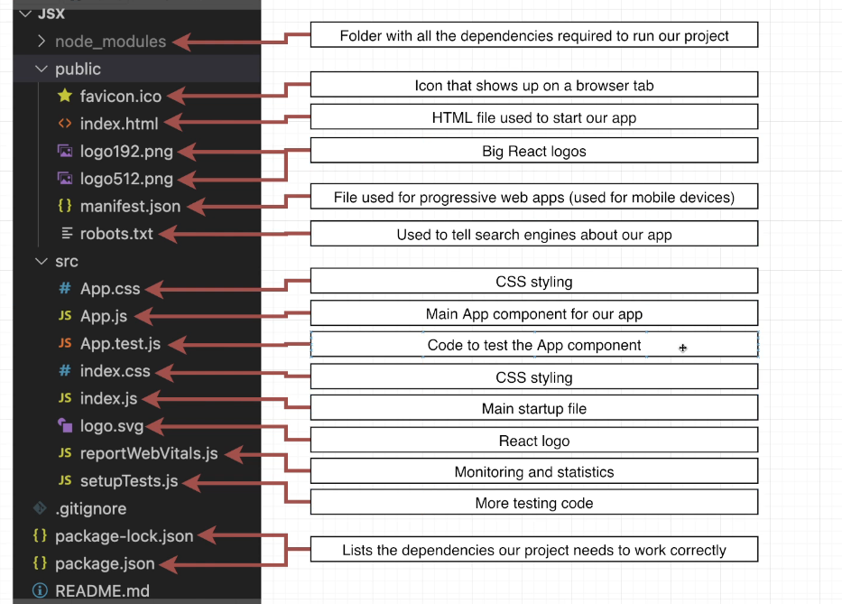
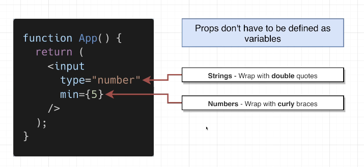

## React App Tutorial

### What is React all about?
- Displays HTML and changes that HTML when the user does something
- React is like a wrapper around HTML
- React is all about JSX
- 
- React components are functions that return JSX
- Each component is responsible for displaying content for certain portion of the application.
- JSX tells react to either display HTML data or display some other components.
- Difference between regular html and Component is that regular HTML begins with a lowercase character.
- So React interprets a lower case element as an HTML tag and an upper case element as another Component
- 
- This is also called component nesting

### How does React application start up?
- 
- 
- 
- 
```js
import { StrictMode } from "react";
import { createRoot } from "react-dom/client";

import App from "./App";

const rootElement = document.getElementById("root");
const root = createRoot(rootElement);

root.render(
  <StrictMode>
    <div className="wrapper">
      <App />
    </div>
  </StrictMode>
);

```

### What are those "useState" functions?
- 

### How were we able to do the translation?
- 

## Starting a Project with Create-React-App
- 
- JSX is not valid browser code
- JSX is convenient and it is easy to make components
- We have to transpile JSX to javascript which can run inside a browser
- 
- We use Babel compiler and Webpack which is a module bundler.
- Babel converts JSX to js and webpack compiles all files into a single bundle.
- 
- manifest.json is a file used for progressive web apps(used for mobile devices)
- robots.txt is a file used to tell search engines about our app.
- Main files needed to run a react application are:
- 
### Why do we have React and ReactDOM as separate libraries ?
- 
- React library defines what a component is and how various components work together. It doesnot know how to create react-app in browser
- ReactDOM library knows how to get a component to show up on the browser.
- Authors of React wanted to use React in different environments like browser or on a mobile device.
- ReactDOM is used to show the components on a browser, whereas ReactNative is used to use React on Mobile Devices.

### How to show a component in React
```js
import React from 'react';
import ReactDOM from 'react-dom/client';

// 2. Get a reference to the div with the ID of root
const el = document.getElementById('root');

// 3. Tell React to take control of that element
const root = ReactDOM.createRoot(el);

// 4. Create a component
function App() {
    return (<h1>Hello there</h1>)
}

// 5. Show the component on the screen
root.render(<App/>)
```
## What is JSX?
- 
- JSX is an instruction to React as to what kind of element we want to display on the screen.
- JSX makes the life of developers easier.
- 
- 
- React can only print out numbers or strings, it doesnot know how to print booleans.
- Objects are not valid as react children
- For example this code won't work and will give an error:
```js
function App() {

    const message = {}
    return (
        <h1>
            {message}
        </h1>
    )
}
```
- 

## Using Props
- Props are similar to attributes on HTML page.
- 
- What is difference between props and HTML attributes?
- 
- 
- 
- 
- Objects cannot be printed on the screen, but they can be provided as props
```js
const inputType = "number"
const minValue = 5;
return (
<input type ={inputType} style={{border:'3px solid red'}} min = {minValue}/>
)
```

## Converting HTML to JSX
- 
- 
- 
- 
- 
- 
- 
- 
- 
- 

## Module Systems Overview
- Import and Export Statements
- 
- Variables aren't shared by default in files
- Separate files are separate isolated contexts
- We can share variables between files using import/export statements
- There are a lot of rules around them
- 
- A file can have a single 'default' export
- What happens when we write : import App from './App'
- 
- Confusing thing! : Default export can be renamed in the importing file.
- We can change the variable to : import App1 from './App'
- This renaming feature is provided so that there is no conflict among variable names inside the importing file. For e.g it may already have a variable named App
- 
- 
```js
//Inside App.js we can have named export like this
export const message = "hi";

//Inside index.js we can import it with curly braces, we cannot rename it
import {message} from "./App";
```
- 
- 

## New React Project
- 
- 
- 
- 


## Props System
- 
- 
- Always remember we get props as an object
- We need to destructure it to use it
```js
import ProfileCard from "./ProfileCard";

function App() {
    return (
        <div className="App">
            <div className="App-header">
                Personal Digital Assistants
            </div>
            <ProfileCard title = "Alex" handle="@alexa99" />
            <ProfileCard title = "Cortana" handle="@cortana" />
            <ProfileCard title = "Siri" handle="@siri" />
        </div>
    )
}

export default App;


function ProfileCard({title, handle}) {
    return (<div>Profile Card!!!! {title} with handle {handle}</div>)
}
export default ProfileCard;
```
## While importing images, we have to add an extension
- 
- If our image is less than 10000 bytes, then the image's raw data is taken, and it is converted to base64 string, and it gets placed as a single string in our javascript file 
- If our image is greater than 10000 bytes, then it is taken as a separate file and its path is taken
- Import statements for images are only used when the images are stored inside our project
- Any images from an external website is treated like any other normal image
- We just need to put in a URL to our image.
- This technique is similarly used for handling fonts and sounds also
- If we pass extra props to a child component, and it doesn't use it, then it is fine, our app will not crash

```js
import ProfileCard from "./ProfileCard";
import AlexaImage from './images/alexa.png'
import CortanaImage from './images/cortana.png'
import SiriImage from './images/siri.png'


function App() {
    return (
        <div className="App">
            <div className="App-header">
                Personal Digital Assistants
            </div>
            <ProfileCard title = "Alex" handle="@alexa99" imgSrc={AlexaImage} />
            <ProfileCard title = "Cortana" handle="@cortana" imgSrc={CortanaImage} />
            <ProfileCard title = "Siri" handle="@siri" imgSrc={SiriImage} />
        </div>
    )
}

export default App;
```
- alt prop is required for images, so that people with eyesight disability, can still read about the image.

## Adding CSS
- 
- Using Bulma
```js


function ProfileCard({title, handle,imgSrc, description}) {
    return (<>
        <div className="card">
            <div className="card-image">
                <figure className="image is-1by1">
                    
                </figure>
            </div>
            <div className="card-content">
                <div className="media-content">
                    <p className="title is-4">
                        Profile Card!!!! {title} with handle {handle}
                    </p>
                </div>
                <div className="content">
                    {description}
                </div>
            </div>
        </div>
    </>)
}

export default ProfileCard;

import 'bulma/css/bulma.css'
import ProfileCard from "./ProfileCard";
import AlexaImage from './images/alexa.png'
import CortanaImage from './images/cortana.png'
import SiriImage from './images/siri.png'


function App() {
    return (
        <div className="App">
            <section className="hero is-primary">
                <div className="hero-body">
                    <p className="title">
                        Personal Digital Assistants
                    </p>
                </div>
            </section>

            <div className="container">
                <section className="section">
                    <div className="columns">
                        <div className="column is-3">
                            <ProfileCard title = "Alexa" handle="@alexa99" imgSrc={AlexaImage} description="Alexa is awesome" />
                        </div>
                        <div className="column is-3">
                            <ProfileCard title = "Cortana" handle="@cortana" imgSrc={CortanaImage} description="Cortana is awesome" />
                        </div>
                        <div className="column is-3">
                            <ProfileCard title = "Siri" handle="@siri" imgSrc={SiriImage} description="Siri is awesome" />
                        </div>
                    </div>
                </section>
            </div>
        </div>
    )
}

export default App;


```
