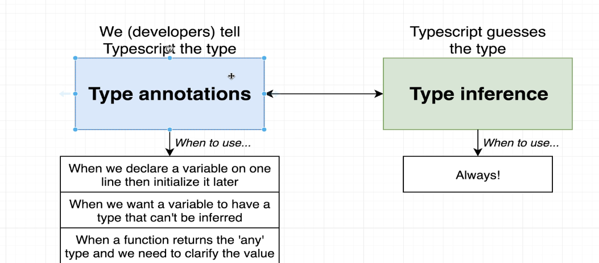

## Typescript Tutorial
- 
- 
- Typescript helps us to catch errors during development.
- Typescript doesn't provide any performance optimization
- Typescript is transpiled into Javascript only
- 
- 

## Typescript Setup
- 
- Run the typescript compiler with this command
```shell
tsc --help
```
- To generate a package json file inside any folder run this command
```shell
npm init -y
```
- We can compile our typescript files like this
```shell
tsc index.ts

//alternatively we can do this to compile and execute the resulting javascript
ts-node index.ts
```
- Interfaces are used in typescript to define the structure of an object 
```ts
interface Todo {
    id: number;
    title: string;
    completed: boolean;
}
```
- We can use typescript inside function arguments like this:
```ts
const logTodo = (id:number,title:string,completed:boolean) =>{
    console.log(`The todo with ID: ${id} and title: ${title} and completed:${completed}`);

}

```
- Typescript will let us pass correct type of arguments to this function


## Typescript Types
- 
- 
- Every value we create has a type assigned to it
- Types are shortcuts to describe various properties and methods a single value has 
- 
- In typescript, we have primitive types and object types
- 
- Types are used by typescript compiler to analyze our code for errors.
- Types allow other engineers to understand what values are flowing around our codebase.
- They help us understand what a function is doing.
- Types are used everywhere.
- Every value we use has a type associated with it.

## Type Annotation and Type Inference
- 
- 
- 

```ts
let apples = 5;

let speed:string = 'fast';

let hasName: boolean = false;
let nothingMuch: null = null;
let nothing:undefined = undefined;

// built in objects
let now:Date = new Date();

// Array
let colors: string[] = ['red', 'green', 'blue', 'yellow'];
let myNumbers: number[] = [1,2,3,4,5,6,7,8,9,10];
let truths: boolean[] = [true,false];

//Classes
class Car {

}
let car: Car = new Car();

// Object literal
let point:{x:number;y:number} = {
  x: 10,
  y:20
};

//Function type annotations
const logNumber:(i:number) => void = (i:number) =>{
    console.log(i)
}
```
## Understanding Inference
- 

```ts
//Here apples is of type any as initialization is on a different line
let apples;
apples = 5;
```
- 
- We try to rely on type inference as much as we can
```ts
// When to use annotations

// 1) Function that returns an 'any' type
//Anytime we can JSON.parse() we can get different types so Typescript cannot predict what will be the return type
// If typescript cant guess, it automatically assigns the 'any' type

const json = '{"x":10,"y":20}';
const coordinates = JSON.parse(json);
console.log(coordinates);

// 2) When we declare a variable on one line and initialize it later, Here typescript gives us a warning for foundWord
let words = ['red','green','blue'];
let foundWord;
for(let i = 0;i<words.length;i++)
{
    if(words[i]==="green"){
        foundWord = true;
    }
}

// 3) Variable whose type cannot be inferred correctly
//Type annotation is required in case of union types
let numbers = [-10,-1,12];
let numbersAboveZero: boolean | number   = false;
for(let i = 0;i<numbers.length;i++)
{
    if(numbers[i] > 0){
        numbersAboveZero = numbers[i];
    }
}
```
- 
- 
- 

### Typescript only works around the return value of a function
```ts
//Example of function annotation
const add = (a:number,b:number):number =>{
    return a + b;
}
```
- 
- Since it looks at the return value of a function, we don't necessarily have to specify annotation around return value of a function
- It is always a good idea, to specify the annotation for the return type of a function

## Annotation for anonymous functions
```ts
function divide(a:number,b:number):number{
    return a / b;
}

const multiply = function(a:number, b:number):number {
    return a * b;
}
```

## Void and Never Types
- A function whose return type has void annotation can return null or undefined 
```ts
const logger = (message:string) : void => {
    console.log(message);
    return null;
    return undefined;
}
```
- To specify a function never returns any value we can use 'never' type like this
```ts
const throwError = (message:string) : never => {
    throw new Error(message);
}
```

## Annotations with destructuring
```ts
const todaysWeather = {
    date:new Date(),
    weather: 'sunny'
};

const logWeather = (forecast:{date:Date, weather:string}): void => {
    console.log(forecast.date);
    console.log(forecast.weather);
}

const logWeather1 = ({date,weather}:{date:Date,weather: string}): void => {
    console.log(date);
    console.log(weather);
}


logWeather(todaysWeather);
```
## Annotations around Objects
```ts
const profile = {
    name:'alex',
    age: 20,
    coords:{
        lat:0,
        lng:15
    },
    setAge(age:number):void{
        this.age = age;
    }
}

const {age}:{age:number} = profile;

const {coords:{lat, lng}}
    :{coords:{lat:number,lng:number}} = profile;

//We cannot do this
//const {age}:number = profile;

```

## Arrays in Typescript
- 
### Why Typed Arrays
- 
```ts
const carMakers : string[] = ['ford','toyota','chevy'];
const carMakers1 = [];

const dates = [new Date(), new Date()];

const carsByMake: string[][] = [
    ['f150'],
    ['camaro'],
    ['corolla']
];

//Help with inference when extracting values
const car = carMakers[0];
const myCar = carMakers.pop();

// Prevent incompatible values
//carMakers.push(100);

// Help with map,foreach, reduce
carMakers.map((car):string=>{
    return car.toUpperCase();
})

// Flexible Types
const importantDates: (Date | string)[] = [new Date,'2030-10-10'];
importantDates.push('fdfd');
importantDates.push(new Date());


```
- 

## Tuples in Typescript and how they are different from Arrays
- 
- Arrays are a collection of different records, Tuples usually contain multiple properties to describe a single thing
- 
- We need a self labeling technique
```ts
const drink = {
    color: 'brown',
    carbonated:true,
    sugar:40
};

//This is an array of union types, we can easily the order of elements and it will break our data model
const pepsi = ['brown',true,40];

//This is a tuple and it ensures order of element types is preserved
const pepsi1:[string,boolean,number] = ['brown',true,40];

//This cannot be done now
//pepsi1[0] = 40;

type Drink = [string,boolean,number];
const sprite: Drink = ['clear', false, 0];
```
## Why Tuples
- Tuples are used too much!
- If we work with a csv file, we may need a tuple
```ts
//Tuples don't convey much meaning about this, and it is difficult to understand
const carSpecs:[number,number] = [400,3354];

//Objects convey a lot of meaning about this data structure
const carStats = {
    horsepower: 400,
    weight: 3354
}
```

## Interfaces
- 
- 
```ts
interface Vehicle {
   name: string;
   year: Date;
   broken: boolean;
   summary(): string;
}

interface Reportable {
    summary():string;
}

const drink = {
    color:'brown',
    carbonated: true,
    sugar: 40,
    summary(): string {
        return `My drink has sugar of ${this.sugar} grams`;
    }
}

const oldCivic:Vehicle = {
    name: "civic",
    year: new Date(),
    broken:true,
    summary(): string {
        return `${this.name} is ${this.year} broken: ${this.broken}`
    }
};

const printVehicle = (vehicle:Vehicle):void => {
    console.log(vehicle.summary())
}

const printReport=(item:Reportable):void => {
    console.log(item.summary());
}

//Valid since both old civic and drink objects have summary functions
//Note these are 2 different objects
//Encourages us to write generic looking interfaces
printReport(oldCivic);
printReport(drink);

printVehicle(oldCivic);
```

- 
- 
- 